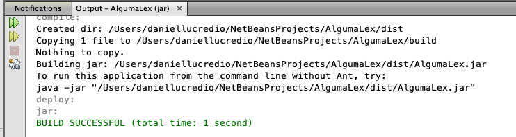
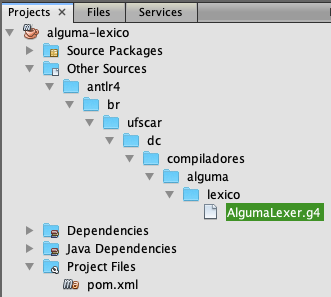
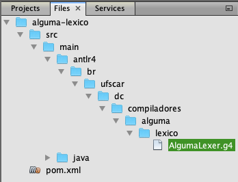

# Construção de Compiladores - Daniel Lucrédio, Helena Caseli, Mário César San Felice e Murilo Naldi
## Tópico 02 - Análise Léxica - Exemplos

### Demonstração 1 – Analisador léxico “na mão” – parte 1

Primeira tentativa de fazer análise léxica: lendo tokens de 1 caractere (ou no máximo 2)

---

1. Criar um novo arquivo, no Desktop, com um programa de exemplo (salvar com codificação utf8)

```
:DECLARACOES
argumento:INT
fatorial:INT

:ALGORITMO
% Calcula o fatorial de um número inteiro
LER argumento
ATRIBUIR argumento A fatorial
SE argumento = 0 ENTAO ATRIBUIR 1 A fatorial
ENQUANTO argumento > 1
   INICIO
      ATRIBUIR fatorial * (argumento - 1) A fatorial
      ATRIBUIR argumento - 1 A argumento
   FIM
IMPRIMIR fatorial
```

2. Abrir o NetBeans, e criar novo projeto Java (com Ant) “AlgumaLex”
- Alternativamente, crie um projeto com Maven:

```sh
mvn archetype:generate "-DarchetypeGroupId=org.apache.maven.archetypes" "-DarchetypeArtifactId=maven-archetype-quickstart" "-DarchetypeVersion=1.4"
```

3. Criar um enum TipoToken

```java
package br.ufscar.dc.algumalex;
public enum TipoToken {
    PCDeclaracoes, PCAlgoritmo, PCInteiro, PCReal, PCAtribuir, PCA, PCLer,
    PCImprimir, PCSe, PCEntao, PCEnquanto, PCInicio, PCFim,
    OpAritMult, OpAritDiv, OpAritSoma, OpAritSub,
    OpRelMenor, OpRelMenorIgual, OpRelMaiorIgual,
    OpRelMaior, OpRelIgual, OpRelDif,
    OpBoolE, OpBoolOu,
    Delim, AbrePar, FechaPar, Var, NumInt, NumReal, Cadeia, Fim
}
```

4. Criar a classe Token

```java
package br.ufscar.dc.algumalex;
public class Token {
    public TipoToken nome;
    public String lexema;

    public Token(TipoToken nome, String lexema) {
        this.nome = nome;
        this.lexema = lexema;
    }
    @Override
    public String toString() {
        return "<"+nome+","+lexema+">";
    }
}
```

5. Criar a classe LeitorDeArquivosTexto

```java
package br.ufscar.dc.algumalex;

import java.io.File;
import java.io.FileInputStream;
import java.io.InputStream;
public class LeitorDeArquivosTexto {
    InputStream is;
    public LeitorDeArquivosTexto(String arquivo) {
        try {
            is = new FileInputStream(new File(arquivo));
        } catch (Exception ex) {
            ex.printStackTrace(System.err);
        }
    }
    public int lerProximoCaractere() {
        try {
            int ret = is.read();
            System.out.print((char)ret);
            return ret;
        } catch (Exception ex) {
            ex.printStackTrace(System.err);
            return -1;
        }
    }
}
```

6. Criar a classe AlgumaLexico

```java
package br.ufscar.dc.algumalex;

public class AlgumaLexico {
    LeitorDeArquivosTexto ldat;
    public AlgumaLexico(String arquivo) {
        ldat = new LeitorDeArquivosTexto(arquivo);
    }
    public Token proximoToken() {
        int caractereLido = -1;
        while((caractereLido = ldat.lerProximoCaractere()) != -1) {
            char c = (char)caractereLido;
            if(c == ' ' || c == '\n') continue;
        }
        return null;
    }
}
```

7. Criar a classe App, com o seguinte código no main() e executar

```java
package br.ufscar.dc.algumalex;

public class App {
    public static void main(String[] args) {
        AlgumaLexico lex = new AlgumaLexico(args[0]);
        Token t = null;
        while ((t = lex.proximoToken()) != null) {
            System.out.print(t);
        }
    }
}
```

- Este é um projeto Java com Ant. No NetBeans, esse tipo de projeto gera um arquivo .jar executável sempre que for construído. Na janela de Saída/output, será exibido o comando correto para sua execução. Exemplo:



- Para rodar, portanto, basta abrir um terminal e executar (tudo em uma linha só, substituindo os caminhos pelos corretos):

```sh
java -jar "/Users/daniellucredio/NetBeansProjects/AlgumaLex/dist/AlgumaLex.jar" /Users/daniellucredio/Desktop/teste.txt
```

- Caso tenha criado o projeto no Maven, para rodar basta executar o seguinte comando:

```sh
mvn exec:java "-Dexec.mainClass=br.ufscar.dc.algumalex.App" "-Dexec.args=C:\Users\dlucr\OneDrive\Desktop\entrada.txt"
```

8. Adicionar na classe AlgumaLexico o código para os tokens com um único caractere e executar

```java
            if(c == ':') {
                return new Token(TipoToken.Delim,":");
            }
            else if(c == '*') {
                return new Token(TipoToken.OpAritMult,"*");
            }
            else if(c == '/') {
                return new Token(TipoToken.OpAritDiv,"/");
            }
            else if(c == '+') {
                return new Token(TipoToken.OpAritSoma,"+");
            }
            else if(c == '-') {
                return new Token(TipoToken.OpAritSub,"-");
            }
            else if(c == '(') {
                return new Token(TipoToken.AbrePar,"(");
            }
            else if(c == ')') {
                return new Token(TipoToken.FechaPar,")");
            }
```

9. Problema: e tokens com mais de um caractere? Adicionar o seguinte código e explicar

```java
            else if(c == '<') {
                c = (char)ldat.lerProximoCaractere();
                if(c == '>')
                    return new Token(TipoToken.OpRelDif,"<>");
                else if(c == '=')
                    return new Token(TipoToken.OpRelMenorIgual,"<=");
                else return new Token(TipoToken.OpRelMenor,"<");
            }
```

10. Mudar, no arquivo de entrada, a linha do ENQUANTO, e mostrar que ainda está funcionando

```
ENQUANTO argumento <= 1
```

11. Mudar, no arquivo de entrada, a linha do ENQUANTO, e mostrar que agora não está mais funcionando (cuidado para não deixar nenhum espaço depois do símbolo “<”)

```
ENQUANTO argumento <1
```

### Demonstração 2 – Analisador léxico “na mão” – parte 2

Adicionando buffer duplo para possibilitar retrocesso

---

1. Abrir projeto da demonstração anterior
2. Modificar a classe LeitorDeArquivosTexto

- Adicionar o código do buffer

```java
    private final static int TAMANHO_BUFFER = 5;
    int[] bufferDeLeitura;
    int ponteiro;
    private void inicializarBuffer() {
        bufferDeLeitura = new int[TAMANHO_BUFFER * 2];
        ponteiro = 0;
        recarregarBuffer1();
    }
    private int lerCaractereDoBuffer() {
        int ret = bufferDeLeitura[ponteiro];
        incrementarPonteiro();
        return ret;
    }
    private void incrementarPonteiro() {
        ponteiro++;
        if (ponteiro == TAMANHO_BUFFER) {
            recarregarBuffer2();
        } else if (ponteiro == TAMANHO_BUFFER * 2) {
            recarregarBuffer1();
            ponteiro = 0;
        }
    }
    private void recarregarBuffer1() {
        try {
            for (int i = 0; i < TAMANHO_BUFFER; i++) {
                bufferDeLeitura[i] = is.read();
                if (bufferDeLeitura[i] == -1) {
                    break;
                }
            }
        } catch (Exception ex) {
            ex.printStackTrace(System.err);
        }
    }
    private void recarregarBuffer2() {
        try {
            for (int i = TAMANHO_BUFFER; i < TAMANHO_BUFFER * 2; i++) {
                bufferDeLeitura[i] = is.read();
                if (bufferDeLeitura[i] == -1) {
                    break;
                }
            }
        } catch (Exception ex) {
            ex.printStackTrace(System.err);
        }
    }
```

- Adicionar chamada para inicializar o buffer no construtor (no final, depois da inicialização do stream)

```java
            inicializarBuffer();
```

- Modificar o método para ler o próximo caractere

```java
    public int lerProximoCaractere() {
        int c = lerCaractereDoBuffer();
        System.out.print((char)c);
        return c;
    }

2.4. Adicionar o código para retroceder

```java
    public void retroceder() {
        ponteiro--;
        if (ponteiro < 0) {
            ponteiro = TAMANHO_BUFFER * 2 - 1;
        }
    }
```

3. Na classe AlgumaLexico, modificar o código que reconhece operadores, para retrair antes de retornar o Token para o “<“

```java
    ldat.retroceder();
```

4. Testar

-  Pode dar erro pois pode acontecer dele recarregar o mesmo lado do buffer 2 vezes. Será corrigido no próximo exemplo.
- No Mac e Linux, o exemplo atual já causa esse erro
- No Windows, precisa acrescentar um ou dois caracteres antes da linha do “ENQUANTO”, e tirar um espaço antes do INICIO


### Demonstração 3 – Analisador léxico “na mão” – parte 3

Possibilitar a análise de diversos padrões “em cascata”

---

1. Abrir projeto da demonstração anterior
2. Na classe LeitorDeArquivosTexto, fazer as seguintes modificações

```diff
package br.ufscar.dc.algumalex;

import java.io.File;
import java.io.FileInputStream;
import java.io.InputStream;
public class LeitorDeArquivosTexto {
+    private final static int TAMANHO_BUFFER = 20;
    int[] bufferDeLeitura;
    int ponteiro;
+    int bufferAtual; // Como agora tem retrocesso, é necessário armazenar o
+                     // buffer atual, pois caso contrário ao retroceder ele
+                     // pode recarregar um mesmo buffer 2 vezes
+    int inicioLexema;
    private String lexema;

    private void inicializarBuffer() {
+        bufferAtual = 2;
+        inicioLexema = 0;
+        lexema = "";
        bufferDeLeitura = new int[TAMANHO_BUFFER * 2];
        ponteiro = 0;
        recarregarBuffer1();    
    }
    private int lerCaractereDoBuffer() {
        int ret = bufferDeLeitura[ponteiro];
+        // System.out.println(this);// descomentar depois
        incrementarPonteiro();
        return ret;
    }
    private void incrementarPonteiro() {
        ponteiro++;
        if (ponteiro == TAMANHO_BUFFER) {
            recarregarBuffer2();
        } else if (ponteiro == TAMANHO_BUFFER * 2) {
            recarregarBuffer1();
            ponteiro = 0;
        }
    }
    private void recarregarBuffer1() {
+        if (bufferAtual == 2) {
+            bufferAtual = 1;
            try {
                for (int i = 0; i < TAMANHO_BUFFER; i++) {
                    bufferDeLeitura[i] = is.read();
                    if (bufferDeLeitura[i] == -1) {
                        break;
                    }
                }
            } catch (Exception ex) {
                ex.printStackTrace(System.err);
            }
+        }
    }
    private void recarregarBuffer2() {
+        if (bufferAtual == 1) {
+            bufferAtual = 2;
            try {
                for (int i = TAMANHO_BUFFER; i < TAMANHO_BUFFER * 2; i++) {
                    bufferDeLeitura[i] = is.read();
                    if (bufferDeLeitura[i] == -1) {
                        break;
                    }
                }
            } catch (Exception ex) {
                ex.printStackTrace(System.err);
            }
+        }
    }
    InputStream is;
    public LeitorDeArquivosTexto(String arquivo) {
        try {
            is = new FileInputStream(new File(arquivo));
            inicializarBuffer();
        } catch (Exception ex) {
            ex.printStackTrace(System.err);
        }
    }
    public int lerProximoCaractere() {
        int c = lerCaractereDoBuffer();
+        lexema += (char) c;
        return c;
    }
    public void retroceder() {
        ponteiro--;
+        lexema = lexema.substring(0, lexema.length() - 1);
        if (ponteiro < 0) {
            ponteiro = TAMANHO_BUFFER * 2 - 1;
        }
    }
+    public void zerar() {
+        ponteiro = inicioLexema;
+        lexema = "";
+    }
+    public void confirmar() {
+        System.out.print(lexema); // comentar para ficar melhor a saída
+        inicioLexema = ponteiro;
+        lexema = "";
+    }
+    public String getLexema() {
+        return lexema;
+    }
+    public String toString() {
+        String ret = "Buffer:[";
+        for (int i : bufferDeLeitura) {
+            char c = (char) i;
+            if (Character.isWhitespace(c)) {
+                ret += ' ';
+            } else {
+                ret += (char) i;
+            }
+        }
+        ret += "]\n";
+        ret += "        ";
+        for (int i = 0; i < TAMANHO_BUFFER * 2; i++) {
+            if (i == inicioLexema && i == ponteiro) {
+                ret += "%";
+            } else if (i == inicioLexema) {
+                ret += "^";
+            } else if (i == ponteiro) {
+                ret += "*";
+            } else {
+                ret += " ";
+            }
+        }
+        return ret;
+    }
```

3. Criar o seguinte código na classe AlgumaLexico (deixar o método proximoToken por último)

```java
package br.ufscar.dc.algumalex;

public class AlgumaLexico {
    LeitorDeArquivosTexto ldat;
    public AlgumaLexico(String arquivo) {
        ldat = new LeitorDeArquivosTexto(arquivo);
    }
    public Token proximoToken() {
        Token proximo = null;
        espacosEComentarios();
        ldat.confirmar();
        proximo = fim();
        if (proximo == null) {
            ldat.zerar();
        } else {
            ldat.confirmar();
            return proximo;
        }
        proximo = palavrasChave();
        if (proximo == null) {
            ldat.zerar();
        } else {
            ldat.confirmar();
            return proximo;
        }
        proximo = variavel();
        if (proximo == null) {
            ldat.zerar();
        } else {
            ldat.confirmar();
            return proximo;
        }
        proximo = numeros();
        if (proximo == null) {
            ldat.zerar();
        } else {
            ldat.confirmar();
            return proximo;
        }
        proximo = operadorAritmetico();
        if (proximo == null) {
            ldat.zerar();
        } else {
            ldat.confirmar();
            return proximo;
        }
        proximo = operadorRelacional();
        if (proximo == null) {
            ldat.zerar();
        } else {
            ldat.confirmar();
            return proximo;
        }
        proximo = delimitador();
        if (proximo == null) {
            ldat.zerar();
        } else {
            ldat.confirmar();
            return proximo;
        }
        proximo = parenteses();
        if (proximo == null) {
            ldat.zerar();
        } else {
            ldat.confirmar();
            return proximo;
        }
        proximo = cadeia();
        if (proximo == null) {
            ldat.zerar();
        } else {
            ldat.confirmar();
            return proximo;
        }
        System.err.println("Erro léxico!");
        System.err.println(ldat.toString());
        return null;
    }
    private Token operadorAritmetico() {
        int caractereLido = ldat.lerProximoCaractere();
        char c = (char) caractereLido;
        if (c == '*') {
            return new Token(TipoToken.OpAritMult, ldat.getLexema());
        } else if (c == '/') {
            return new Token(TipoToken.OpAritDiv, ldat.getLexema());
        } else if (c == '+') {
            return new Token(TipoToken.OpAritSoma, ldat.getLexema());
        } else if (c == '-') {
            return new Token(TipoToken.OpAritSub, ldat.getLexema());
        } else {
            return null;
        }
    }
    private Token delimitador() {
        int caractereLido = ldat.lerProximoCaractere();
        char c = (char) caractereLido;
        if (c == ':') {
            return new Token(TipoToken.Delim, ldat.getLexema());
        } else {
            return null;
        }
    }

    private Token parenteses() {
        int caractereLido = ldat.lerProximoCaractere();
        char c = (char) caractereLido;
        if (c == '(') {
            return new Token(TipoToken.AbrePar, ldat.getLexema());
        } else if (c == ')') {
            return new Token(TipoToken.FechaPar, ldat.getLexema());
        } else {
            return null;
        }
    }
    private Token operadorRelacional() {
        int caractereLido = ldat.lerProximoCaractere();
        char c = (char) caractereLido;
        if (c == '<') {
            c = (char) ldat.lerProximoCaractere();
            if (c == '>') {
                return new Token(TipoToken.OpRelDif, ldat.getLexema());
            } else if (c == '=') {
                return new Token(TipoToken.OpRelMenorIgual, ldat.getLexema());
            } else {
                ldat.retroceder();
                return new Token(TipoToken.OpRelMenor, ldat.getLexema());
            }
        } else if (c == '=') {
            return new Token(TipoToken.OpRelIgual, ldat.getLexema());
        } else if (c == '>') {
            c = (char) ldat.lerProximoCaractere();
            if (c == '=') {
                return new Token(TipoToken.OpRelMaiorIgual, ldat.getLexema());
            } else {
                ldat.retroceder();
                return new Token(TipoToken.OpRelMaior, ldat.getLexema());
            }
        }
        return null;
    }
    private Token numeros() {
        int estado = 1;
        while (true) {
            char c = (char) ldat.lerProximoCaractere();
            if (estado == 1) {
                if (Character.isDigit(c)) {
                    estado = 2;
                } else {
                    return null;
                }
            } else if (estado == 2) {
                if (c == '.') {
                    c = (char) ldat.lerProximoCaractere();
                    if (Character.isDigit(c)) {
                        estado = 3;
                    } else {
                        return null;
                    }
                } else if (!Character.isDigit(c)) {
                    ldat.retroceder();
                    return new Token(TipoToken.NumInt, ldat.getLexema());
                }
            } else if (estado == 3) {
                if (!Character.isDigit(c)) {
                    ldat.retroceder();
                    return new Token(TipoToken.NumReal, ldat.getLexema());
                }
            }
        }
    }
    private Token variavel() {
        int estado = 1;
        while (true) {
            char c = (char) ldat.lerProximoCaractere();
            if (estado == 1) {
                if (Character.isLetter(c)) {
                    estado = 2;
                } else {
                    return null;
                }
            } else if (estado == 2) {
                if (!Character.isLetterOrDigit(c)) {
                    ldat.retroceder();
                    return new Token(TipoToken.Var, ldat.getLexema());
                }
            }
        }
    }
    private Token cadeia() {
        int estado = 1;
        while (true) {
            char c = (char) ldat.lerProximoCaractere();
            if (estado == 1) {
                if (c == '\'') {
                    estado = 2;
                } else {
                    return null;
                }
            } else if (estado == 2) {
                if (c == '\n') {
                    return null;
                }
                if (c == '\'') {
                    return new Token(TipoToken.Cadeia, ldat.getLexema());
                } else if (c == '\\') {
                    estado = 3;
                }
            } else if (estado == 3) {
                if (c == '\n') {
                    return null;
                } else {
                    estado = 2;
                }
            }
        }
    }
    private void espacosEComentarios() {
        int estado = 1;
        while (true) {
            char c = (char) ldat.lerProximoCaractere();
            if (estado == 1) {
                if (Character.isWhitespace(c) || c == ' ') {
                    estado = 2;
                } else if (c == '%') {
                    estado = 3;
                } else {
                    ldat.retroceder();
                    return;
                }
            } else if (estado == 2) {
                if (c == '%') {
                    estado = 3;
                } else if (!(Character.isWhitespace(c) || c == ' ')) {
                    ldat.retroceder();
                    return;
                }
            } else if (estado == 3) {
                if (c == '\n') {
                    return;
                }
            }
        }
    }
    private Token palavrasChave() {
        while (true) {
            char c = (char) ldat.lerProximoCaractere();
            if (!Character.isLetter(c)) {
                ldat.retroceder();
                String lexema = ldat.getLexema();
                if (lexema.equals("DECLARACOES")) {
                    return new Token(TipoToken.PCDeclaracoes, lexema);
                } else if (lexema.equals("ALGORITMO")) {
                    return new Token(TipoToken.PCAlgoritmo, lexema);
                } else if (lexema.equals("INT")) {
                    return new Token(TipoToken.PCInteiro, lexema);
                } else if (lexema.equals("REAL")) {
                    return new Token(TipoToken.PCReal, lexema);
                } else if (lexema.equals("ATRIBUIR")) {
                    return new Token(TipoToken.PCAtribuir, lexema);
                } else if (lexema.equals("A")) {
                    return new Token(TipoToken.PCA, lexema);
                } else if (lexema.equals("LER")) {
                    return new Token(TipoToken.PCLer, lexema);
                } else if (lexema.equals("IMPRIMIR")) {
                    return new Token(TipoToken.PCImprimir, lexema);
                } else if (lexema.equals("SE")) {
                    return new Token(TipoToken.PCSe, lexema);
                } else if (lexema.equals("ENTAO")) {
                    return new Token(TipoToken.PCEntao, lexema);
                } else if (lexema.equals("ENQUANTO")) {
                    return new Token(TipoToken.PCEnquanto, lexema);
                } else if (lexema.equals("INICIO")) {
                    return new Token(TipoToken.PCInicio, lexema);
                } else if (lexema.equals("FIM")) {
                    return new Token(TipoToken.PCFim, lexema);
                } else if (lexema.equals("E")) {
                    return new Token(TipoToken.OpBoolE, lexema);
                } else if (lexema.equals("OU")) {
                    return new Token(TipoToken.OpBoolOu, lexema);
                } else {
                    return null;
                }
            }
        }
    }
    private Token fim() {
        int caractereLido = ldat.lerProximoCaractere();
        if (caractereLido == -1) {
            return new Token(TipoToken.Fim, "Fim");
        }
        return null;
    }
}
```

4. Mudar o método no void main para parar ao encontrar o token Fim

```java
        Token t = null;
        while((t=lex.proximoToken()).nome != TipoToken.Fim) {
            System.out.println(t);
        }
```

5. Executar e mudar o arquivo de entrada para testar


### Demonstração 4 – Analisador léxico com ANTLR

---

1. Mostrar o site do ANTLR (www.antlr.org). Nesta demonstração faremos a instalação pelo Maven
2. Abrir o NetBeans e criar novo projeto Java Maven

Ou executar o comando do maven manualmente:

```sh
mvn archetype:generate "-DarchetypeGroupId=org.apache.maven.archetypes" "-DarchetypeArtifactId=maven-archetype-quickstart" "-DarchetypeVersion=1.4"
```

Define value for property 'groupId': br.ufscar.dc.compiladores
Define value for property 'artifactId': alguma-lexico
Define value for property 'version' 1.0-SNAPSHOT: :
Define value for property 'package' br.ufscar.dc.compiladores: : br.ufscar.dc.compiladores.alguma.lexico


- Modificar o arquivo pom.xml para incluir a dependência para o ANTLR e o plugin do ANTLR

```diff
<?xml version="1.0" encoding="UTF-8"?>

<project xmlns="http://maven.apache.org/POM/4.0.0"
    xmlns:xsi="http://www.w3.org/2001/XMLSchema-instance"
    xsi:schemaLocation="http://maven.apache.org/POM/4.0.0 http://maven.apache.org/xsd/maven-4.0.0.xsd">
    <modelVersion>4.0.0</modelVersion>

    <groupId>br.ufscar.dc.compiladores</groupId>
    <artifactId>alguma-lexico</artifactId>
    <version>1.0-SNAPSHOT</version>

    <name>alguma-lexico</name>
    <!-- FIXME change it to the project's website -->
    <url>http://www.example.com</url>

    <properties>
        <project.build.sourceEncoding>UTF-8</project.build.sourceEncoding>
        <maven.compiler.source>1.7</maven.compiler.source>
        <maven.compiler.target>1.7</maven.compiler.target>
    </properties>

    <dependencies>
        <dependency>
            <groupId>junit</groupId>
            <artifactId>junit</artifactId>
            <version>4.11</version>
            <scope>test</scope>
        </dependency>
+        <dependency>
+            <groupId>org.antlr</groupId>
+            <artifactId>antlr4</artifactId>
+            <version>4.12.0</version>
+            <classifier>complete</classifier>
+        </dependency>
    </dependencies>

    <build>
+        <plugins>
+            <plugin>
+                <groupId>org.antlr</groupId>
+                <artifactId>antlr4-maven-plugin</artifactId>
+                <version>4.12.0</version>
+                <executions>
+                    <execution>
+                        <id>antlr</id>
+                        <goals>
+                            <goal>antlr4</goal>
+                        </goals>
+                    </execution>
+                </executions>
+            </plugin>
+            <plugin>
+                <artifactId>maven-assembly-plugin</artifactId>
+                <configuration>
+                    <archive>
+                        <manifest>
+                            <mainClass>br.ufscar.dc.compiladores.alguma.lexico.Principal</mainClass>
+                        </manifest>
+                    </archive>
+                    <descriptorRefs>
+                        <descriptorRef>jar-with-dependencies</descriptorRef>
+                    </descriptorRefs>
+                </configuration>
+                <executions>
+                    <execution>
+                        <id>make-assembly</id>
+                        <phase>package</phase>
+                        <goals>
+                            <goal>single</goal>
+                        </goals>
+                    </execution>
+                </executions>
+            </plugin>
+        </plugins>
+
        <pluginManagement><!-- lock down plugins versions to avoid using Maven defaults (may be
            moved to parent pom) -->
            <plugins>
                <!-- clean lifecycle, see
                https://maven.apache.org/ref/current/maven-core/lifecycles.html#clean_Lifecycle -->
                <plugin>
                    <artifactId>maven-clean-plugin</artifactId>
                    <version>3.1.0</version>
                </plugin>
                <!-- default lifecycle, jar packaging: see
                https://maven.apache.org/ref/current/maven-core/default-bindings.html#Plugin_bindings_for_jar_packaging -->
                <plugin>
                    <artifactId>maven-resources-plugin</artifactId>
                    <version>3.0.2</version>
                </plugin>
                <plugin>
                    <artifactId>maven-compiler-plugin</artifactId>
                    <version>3.8.0</version>
                </plugin>
                <plugin>
                    <artifactId>maven-surefire-plugin</artifactId>
                    <version>2.22.1</version>
                </plugin>
                <plugin>
                    <artifactId>maven-jar-plugin</artifactId>
                    <version>3.0.2</version>
                </plugin>
                <plugin>
                    <artifactId>maven-install-plugin</artifactId>
                    <version>2.5.2</version>
                </plugin>
                <plugin>
                    <artifactId>maven-deploy-plugin</artifactId>
                    <version>2.8.2</version>
                </plugin>
                <!-- site lifecycle, see
                https://maven.apache.org/ref/current/maven-core/lifecycles.html#site_Lifecycle -->
                <plugin>
                    <artifactId>maven-site-plugin</artifactId>
                    <version>3.7.1</version>
                </plugin>
                <plugin>
                    <artifactId>maven-project-info-reports-plugin</artifactId>
                    <version>3.0.0</version>
                </plugin>
            </plugins>
        </pluginManagement>
    </build>
</project>
```

3. Criar um novo arquivo do tipo ANTLR Lexer Grammar, chamado `AlgumaLexer.g4`
- O plugin ANTLR-Maven exige que o arquivo com a gramática seja incluído em um diretório específico dentro da pasta src/main do projeto. Esse diretório deve se chamar “antlr4” e deve ter a mesma estrutura de diretórios que os pacotes Java. A figura a seguir ilustra o local exato onde deve ser criado o arquivo. Observe que no NetBeans é necessário alternar para a aba “arquivos/files” (topo da imagem):



- Ao retornar para a aba “projetos/projects” a nova estrutura de diretórios irá aparecer dentro de “other sources”, como na figura a seguir:



- O conteúdo do arquivo é o seguinte

```
lexer grammar AlgumaLexer;

Letra		:	'a'..'z' | 'A'..'Z';
Digito	:	'0'..'9';
Variavel	:	Letra(Letra|Digito)* { System.out.print("[Var,"+getText()+"]");};
```

4. Mandar gerar o reconhecedor
- Basta clicar com o botão direito no projeto e selecionar a opção “Build/Construir”. Será gerada uma nova pasta de código-fonte, chamada “Generated sources (antlr4)”, onde o código gerado terá a estrutura correta de pacotes.
- Caso exista algum erro no arquivo da gramática, o processo irá gerar um erro. Observar na janela de “Saída/output” para identificar a origem do erro.
- Caso não esteja usando NetBeans, basta executar o comando: `mvn package`

Obs: IMPORTANTE, na versão 4.12 do antlr, pode existir um problema de compilação causado por diretórios que começam com a letra "u". Pode gerar um erro do tipo "illegal unicode character". Se isso acontecer, mude a versão para uma anterior.

5. Criar a classe br.ufscar.dc.compiladores.compilador.alguma.Principal:

```java
package br.ufscar.dc.compiladores.alguma.lexico;

import java.io.IOException;
import org.antlr.v4.runtime.CharStream;
import org.antlr.v4.runtime.CharStreams;
import org.antlr.v4.runtime.Token;

public class Principal {

    public static void main(String[] args) {
        try {
            // args[0] é o primeiro argumento da linha de comando
            CharStream cs = CharStreams.fromFileName(args[0]);
            AlgumaLexer lex = new AlgumaLexer(cs);
            while (lex.nextToken().getType() != Token.EOF) {
                System.out.println("");
            }
        } catch (IOException ex) {
        }
    }
}
```

6. Testar
- Construir o projeto novamente. Devido às configurações do arquivo pom.xml, será gerado na pasta “target” um arquivo .jar com todas as dependências necessárias para execução (incluindo o runtime do antlr)
- Para executar, abrir um terminal e executar o comando (tudo em uma linha só, não esquecer de substituir os caminhos deste exemplo pelos reais)

```sh
java -jar /Users/daniellucredio/NetBeansProjects/alguma-lexico/target/alguma-lexico-1.0-SNAPSHOT-jar-with-dependencies.jar /Users/daniellucredio/Desktop/teste.txt
```

### Demonstração 5 – Expressões regulares no antlr

---

1. Abrir no NetBeans o projeto da demonstração anterior
2. Modificar a gramática AlgumaLexer

```antlr
lexer grammar AlgumaLexer;

PALAVRA_CHAVE 
	:	'DECLARACOES' | 'ALGORITMO' | 'INT' | 'REAL' | 'ATRIBUIR' | 'A' | 'LER' | 'IMPRIMIR' | 'SE' | 'ENTAO' 
	| 'ENQUANTO' | 'INICIO' | 'FIM' | 'E' | 'OU' 
	; 
NUMINT	: ('+'|'-')?('0'..'9')+
	;
NUMREAL	: ('+'|'-')?('0'..'9')+ ('.' ('0'..'9')+)?
	;
VARIAVEL : ('a'..'z'|'A'..'Z') ('a'..'z'|'A'..'Z'|'0'..'9')*
	 ;
CADEIA 	: '\'' ( ESC_SEQ | ~('\''|'\\') )* '\''
	;
fragment
ESC_SEQ	: '\\\'';
COMENTARIO
    :   '%' ~('\n'|'\r')* '\r'? '\n' {skip();}
    ;
WS  :   ( ' '
        | '\t'
        | '\r'
        | '\n'
        ) {skip();}
    ;
OP_REL	:	'>' | '>=' | '<' | '<=' | '<>' | '='
	;
OP_ARIT	:	'+' | '-' | '*' | '/'
	;
DELIM	:	':'
	;
ABREPAR :	'('
	;
FECHAPAR:	')'
	;
```

3. Modificar o método principal

```diff
        try {
            CharStream cs = CharStreams.fromFileName(args[0]);
            AlgumaLexer lex = new AlgumaLexer(cs);

+            Token t = null;
+            while ((t = lex.nextToken()).getType() != Token.EOF) {
+                System.out.println("<"+t.getType() + "," + t.getText()+">");
+            }

        } catch (IOException ex) {
        }
```

4. Testar e rodar
- O número que aparece como tipo do token corresponde aos tipos que aparecem no arquivo “AlgumaLexer.tokens”, gerado pelo antlr
- Para exibir os nomes reais dos tokens, substituir o código na classe Principal pelo seguinte:

```diff
        try {
            CharStream cs = CharStreams.fromFileName(args[0]);
            AlgumaLexer lex = new AlgumaLexer(cs);
            Token t = null;
            while ((t = lex.nextToken()).getType() != Token.EOF) {
+                System.out.println("<" + AlgumaLexer.VOCABULARY.getDisplayName(t.getType()) + "," + t.getText() + ">");
            }

        } catch (IOException ex) {
        }
```

5. Tentar colocar a regra de palavras-chave depois da regra de variáveis e testar novamente
- Observar o resultado, e ver que agora todas as palavras-chave são reconhecidas como variáveis
6. Mostrar os exemplos de regras gananciosas/não gananciosas, para o caso das cadeias
- Usar a seguinte regra para cadeia

```
CADEIA	: '\'' .* '\''
		;
```

- Mostrar que ele gera warning. Pode ser necessário limpar e gerar os fontes de novo:

```sh
mvn clean
mvn generate-sources
```

- Modificar o arquivo de entrada, para ter uma cadeia

```
LER 'abcd' argumento 'defg'
ATRIBUIR argumento A fatorial 'hij'
```
 
- Usar o operador não-ganancioso

```
CADEIA	: '\'' .*? '\''
		;
```
- Testar de novo
- Tentar outra regra gananciosa

```
CADEIA 	: '\'' ( ~('\n') )* '\''
;
```

- Mostrar que agora nem deu warning (era por causa do wildcard)
- Fazer agora a versão não-gananciosa

```
CADEIA 	: '\'' ( ~('\n') )*? '\''
;
```
- Testar de novo

