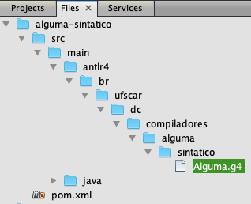

# Construção de Compiladores - Daniel Lucrédio, Helena Caseli, Mário César San Felice e Murilo Naldi
## Tópico 06 - Análise Sintática Conclusão - Exemplos

### Demonstração 1 – Analisador sintático preditivo de descendência recursiva “na mão”
---

1. Criar um novo arquivo, no Desktop, com um programa de exemplo

```
:DECLARACOES
numero1:INTEIRO
numero2:INTEIRO
numero3:INTEIRO
aux:INTEIRO

:ALGORITMO
% Coloca 3 números em ordem crescente
LER numero1
LER numero2
LER numero3
SE numero1 > numero2 ENTAO
   INICIO
      ATRIBUIR 2+3-4+5-6*5-1 A aux
      ATRIBUIR numero1 A numero2
      ATRIBUIR aux A numero1
   FIM 
SE numero1 > numero3 E numero2 <= numero4 E numero1 > 3 OU numero2 <> numero4 ENTAO
   INICIO
      ATRIBUIR (numero3) A aux
      ATRIBUIR numero1 A numero3
      ATRIBUIR aux A numero1
   FIM
SE numero2 > numero3 ENTAO
   INICIO
      ATRIBUIR numero3 A aux
      ATRIBUIR numero2 A numero3
      ATRIBUIR aux A numero2
   FIM
IMPRIMIR numero1
IMPRIMIR numero2
IMPRIMIR numero3
```

2. Abrir o NetBeans, e abrir projeto Java “AlgumaLex”
3. Criar novo projeto Java (com Ant) “AlgumaParser”
4. Adicionar dependência do “AlgumaParser” para o “AlgumaLex”
5. Criar um arquivo com a gramática

```
programa : ':' 'DECLARACOES' listaDeclaracoes ':' 'ALGORITMO' listaComandos;
listaDeclaracoes : declaracao listaDeclaracoes | declaracao;
declaracao : VARIAVEL ':' tipoVar;
tipoVar : 'INTEIRO' | 'REAL';
expressaoAritmetica : expressaoAritmetica '+' termoAritmetico | expressaoAritmetica '-' termoAritmetico | termoAritmetico;
termoAritmetico : termoAritmetico '*' fatorAritmetico | termoAritmetico '/' fatorAritmetico | fatorAritmetico;
fatorAritmetico : NUMINT | NUMREAL | VARIAVEL | '(' expressaoAritmetica ')'
expressaoRelacional : expressaoRelacional operadorBooleano termoRelacional | termoRelacional;
termoRelacional : expressaoAritmetica OP_REL expressaoAritmetica | '(' expressaoRelacional ')';
operadorBooleano : 'E' | 'OU';
listaComandos : comando listaComandos | comando;
comando : comandoAtribuicao | comandoEntrada | comandoSaida | comandoCondicao | comandoRepeticao | subAlgoritmo;
comandoAtribuicao : 'ATRIBUIR' expressaoAritmetica 'A' VARIAVEL;
comandoEntrada : 'LER' VARIAVEL;
comandoSaida : 'IMPRIMIR'  (VARIAVEL | CADEIA);
comandoCondicao : 'SE' expressaoRelacional 'ENTAO' comando | 'SE' expressaoRelacional 'ENTAO' comando 'SENAO' comando;
comandoRepeticao : 'ENQUANTO' expressaoRelacional comando;
subAlgoritmo : 'INICIO' listaComandos 'FIM';
```

6. Criar uma classe algumaparser.AlgumaParser

```java
package algumaparser;

import algumalex.AlgumaLexico;
import algumalex.TipoToken;
import algumalex.Token;
import java.util.ArrayList;
import java.util.List;

public class AlgumaParser {

    private final static int TAMANHO_BUFFER = 10;
    List<Token> bufferTokens;
    AlgumaLexico lex;
    boolean chegouNoFim = false;

    public AlgumaParser(AlgumaLexico lex) {
        this.lex = lex;
        bufferTokens = new ArrayList<Token>();
        lerToken();
    }

    private void lerToken() {
        if (bufferTokens.size() > 0) {
            bufferTokens.remove(0);
        }
        while (bufferTokens.size() < TAMANHO_BUFFER && !chegouNoFim) {
            Token proximo = lex.proximoToken();
            bufferTokens.add(proximo);
            if (proximo.nome == TipoToken.Fim) {
                chegouNoFim = true;
            }
        }
        System.out.println("Lido:  " + lookahead(1));
    }

    void match(TipoToken tipo) {
        if (lookahead(1).nome == tipo) {
            System.out.println("Match: " + lookahead(1));
            lerToken();
        } else {
            erroSintatico(tipo.toString());
        }
    }

    Token lookahead(int k) {
        if (bufferTokens.isEmpty()) {
            return null;
        }
        if (k - 1 >= bufferTokens.size()) {
            return bufferTokens.get(bufferTokens.size() - 1);
        }
        return bufferTokens.get(k - 1);
    }

    void erroSintatico(String... tokensEsperados) {
        String mensagem = "Erro sintático: esperando um dos seguintes (";
        for(int i=0;i<tokensEsperados.length;i++) {
            mensagem += tokensEsperados[i];
            if(i<tokensEsperados.length-1)
                mensagem += ",";
        }
        mensagem += "), mas foi encontrado " + lookahead(1);
        throw new RuntimeException(mensagem);
    }
}
```

7. Copiar a gramática para dentro do arquivo AlgumaParser.java, comentando suas linhas
8. Transformar cada linha em um método

```java
    //programa : ':' 'DECLARACOES' listaDeclaracoes ':' 'ALGORITMO' listaComandos;
    public void programa() {
        match(TipoToken.Delim);
        match(TipoToken.PCDeclaracoes);
        listaDeclaracoes();
        match(TipoToken.Delim);
        match(TipoToken.PCAlgoritmo);
        listaComandos();
        match(TipoToken.Fim);
    }

    //listaDeclaracoes : declaracao listaDeclaracoes | declaracao;
    void listaDeclaracoes() {
        // usaremos lookahead(4)
        // Mas daria para fatorar à esquerda
        // Veja na lista de comandos um exemplo
        if (lookahead(4).nome == TipoToken.Delim) {
            declaracao();
        } else if (lookahead(4).nome == TipoToken.Var) {
            declaracao();
            listaDeclaracoes();
        } else {
            erroSintatico(TipoToken.Delim.toString(), TipoToken.Var.toString());
        }
    }

    //declaracao : VARIAVEL ':' tipoVar;
    void declaracao() {
        match(TipoToken.Var);
        match(TipoToken.Delim);
        tipoVar();
    }

    //tipoVar : 'INTEIRO' | 'REAL';
    void tipoVar() {
        if (lookahead(1).nome == TipoToken.PCInteiro) {
            match(TipoToken.PCInteiro);
        } else if (lookahead(1).nome == TipoToken.PCReal) {
            match(TipoToken.PCReal);
        } else {
            erroSintatico("INTEIRO","REAL");
        }
    }

    //expressaoAritmetica : expressaoAritmetica '+' termoAritmetico | expressaoAritmetica '-' termoAritmetico | termoAritmetico;
    // fatorar à esquerda:
    // expressaoAritmetica : expressaoAritmetica ('+' termoAritmetico | '-' termoAritmetico) | termoAritmetico;
    // fatorar não é suficiente, pois causa loop infinito
    // remover a recursão à esquerda
    // expressaoAritmetica : termoAritmetico expressaoAritmetica2
    // expressaoAritmetica2 : ('+' termoAritmetico | '-' termoAritmetico) expressaoAritmetica2 | <<vazio>>
    void expressaoAritmetica() {
        termoAritmetico();
        expressaoAritmetica2();
    }

    void expressaoAritmetica2() {
        if (lookahead(1).nome == TipoToken.OpAritSoma || lookahead(1).nome == TipoToken.OpAritSub) {
            expressaoAritmetica2SubRegra1();
            expressaoAritmetica2();
        } else { // vazio
        }
    }

    void expressaoAritmetica2SubRegra1() {
        if (lookahead(1).nome == TipoToken.OpAritSoma) {
            match(TipoToken.OpAritSoma);
            termoAritmetico();
        } else if (lookahead(1).nome == TipoToken.OpAritSub) {
            match(TipoToken.OpAritSub);
            termoAritmetico();
        } else {
            erroSintatico("+","-");
        }
    }

    //termoAritmetico : termoAritmetico '*' fatorAritmetico | termoAritmetico '/' fatorAritmetico | fatorAritmetico;
    // também precisa fatorar à esquerda e eliminar recursão à esquerda
    // termoAritmetico : fatorAritmetico termoAritmetico2
    // termoAritmetico2 : ('*' fatorAritmetico | '/' fatorAritmetico) termoAritmetico2 | <<vazio>>
    void termoAritmetico() {
        fatorAritmetico();
        termoAritmetico2();
    }

    void termoAritmetico2() {
        if (lookahead(1).nome == TipoToken.OpAritMult || lookahead(1).nome == TipoToken.OpAritDiv) {
            termoAritmetico2SubRegra1();
            termoAritmetico2();
        } else { // vazio
        }
    }

    void termoAritmetico2SubRegra1() {
        if (lookahead(1).nome == TipoToken.OpAritMult) {
            match(TipoToken.OpAritMult);
            fatorAritmetico();
        } else if (lookahead(1).nome == TipoToken.OpAritDiv) {
            match(TipoToken.OpAritDiv);
            fatorAritmetico();
        } else {
            erroSintatico("*","/");
        }
    }

    //fatorAritmetico : NUMINT | NUMREAL | VARIAVEL | '(' expressaoAritmetica ')'
    void fatorAritmetico() {
        if (lookahead(1).nome == TipoToken.NumInt) {
            match(TipoToken.NumInt);
        } else if (lookahead(1).nome == TipoToken.NumReal) {
            match(TipoToken.NumReal);
        } else if (lookahead(1).nome == TipoToken.Var) {
            match(TipoToken.Var);
        } else if (lookahead(1).nome == TipoToken.AbrePar) {
            match(TipoToken.AbrePar);
            expressaoAritmetica();
            match(TipoToken.FechaPar);
        } else {
            erroSintatico(TipoToken.NumInt.toString(),TipoToken.NumReal.toString(),TipoToken.Var.toString(),"(");
        }
    }

    //expressaoRelacional : expressaoRelacional operadorBooleano termoRelacional | termoRelacional;
    // Precisa eliminar a recursão à esquerda
    // expressaoRelacional : termoRelacional expressaoRelacional2;
    // expressaoRelacional2 : operadorBooleano termoRelacional expressaoRelacional2 | <<vazio>>
    void expressaoRelacional() {
        termoRelacional();
        expressaoRelacional2();
    }

    void expressaoRelacional2() {
        if (lookahead(1).nome == TipoToken.PCE || lookahead(1).nome == TipoToken.PCOu) {
            operadorBooleano();
            termoRelacional();
            expressaoRelacional2();
        } else { // vazio
        }
    }

    //termoRelacional : expressaoAritmetica OP_REL expressaoAritmetica | '(' expressaoRelacional ')';
    void termoRelacional() {
        if (lookahead(1).nome == TipoToken.NumInt
                || lookahead(1).nome == TipoToken.NumReal
                || lookahead(1).nome == TipoToken.Var
                || lookahead(1).nome == TipoToken.AbrePar) {
            // Há um não-determinismo aqui.
            // AbrePar pode ocorrer tanto em expressaoAritmetica como em (expressaoRelacional)
            // Tem uma forma de resolver este problema, mas não usaremos aqui
            // Vamos modificar a linguagem, eliminando a possibilidade
            // de agrupar expressões relacionais com parêntesis
            expressaoAritmetica();
            opRel();
            expressaoAritmetica();
        } else {
            erroSintatico(TipoToken.NumInt.toString(),TipoToken.NumReal.toString(),TipoToken.Var.toString(),"(");
        }
    }

    void opRel() {
        if (lookahead(1).nome == TipoToken.OpRelDif) {
            match(TipoToken.OpRelDif);
        } else if (lookahead(1).nome == TipoToken.OpRelIgual) {
            match(TipoToken.OpRelIgual);
        } else if (lookahead(1).nome == TipoToken.OpRelMaior) {
            match(TipoToken.OpRelMaior);
        } else if (lookahead(1).nome == TipoToken.OpRelMaiorIgual) {
            match(TipoToken.OpRelMaiorIgual);
        } else if (lookahead(1).nome == TipoToken.OpRelMenor) {
            match(TipoToken.OpRelMenor);
        } else if (lookahead(1).nome == TipoToken.OpRelMenorIgual) {
            match(TipoToken.OpRelMenorIgual);
        } else {
            erroSintatico("<>","=",">",">=","<","<=");
        }
    }

    //operadorBooleano : 'E' | 'OU';
    void operadorBooleano() {
        if (lookahead(1).nome == TipoToken.PCE) {
            match(TipoToken.PCE);
        } else if (lookahead(1).nome == TipoToken.PCOu) {
            match(TipoToken.PCOu);
        } else {
            erroSintatico("E","OU");
        }
    }

    //listaComandos : comando listaComandos | comando;
    // vamos fatorar à esquerda
    // listaComandos : comando (listaComandos | <<vazio>>)
    void listaComandos() {
        comando();
        listaComandosSubRegra1();
    }

    void listaComandosSubRegra1() {
        if (lookahead(1).nome == TipoToken.PCAtribuir ||
        lookahead(1).nome == TipoToken.PCLer ||
        lookahead(1).nome == TipoToken.PCImprimir ||
        lookahead(1).nome == TipoToken.PCSe ||
        lookahead(1).nome == TipoToken.PCEnquanto ||
        lookahead(1).nome == TipoToken.PCInicio) {
            listaComandos();
        } else {
            // vazio
        }
    }

    //comando : comandoAtribuicao | comandoEntrada | comandoSaida | comandoCondicao | comandoRepeticao | subAlgoritmo;
    void comando() {
        if (lookahead(1).nome == TipoToken.PCAtribuir) {
            comandoAtribuicao();
        } else if (lookahead(1).nome == TipoToken.PCLer) {
            comandoEntrada();
        } else if (lookahead(1).nome == TipoToken.PCImprimir) {
            comandoSaida();
        } else if (lookahead(1).nome == TipoToken.PCSe) {
            comandoCondicao();
        } else if (lookahead(1).nome == TipoToken.PCEnquanto) {
            comandoRepeticao();
        } else if (lookahead(1).nome == TipoToken.PCInicio) {
            subAlgoritmo();
        } else {
            erroSintatico("ATRIBUIR","LER","IMPRIMIR","SE","ENQUANTO","INICIO");
        }
    }

    //comandoAtribuicao : 'ATRIBUIR' expressaoAritmetica 'A' VARIAVEL;
    void comandoAtribuicao() {
        match(TipoToken.PCAtribuir);
        expressaoAritmetica();
        match(TipoToken.PCA);
        match(TipoToken.Var);
    }

    //comandoEntrada : 'LER' VARIAVEL;
    void comandoEntrada() {
        match(TipoToken.PCLer);
        match(TipoToken.Var);
    }

    //comandoSaida : 'IMPRIMIR'  (VARIAVEL | CADEIA);
    void comandoSaida() {
        match(TipoToken.PCImprimir);
        comandoSaidaSubRegra1();
    }

    void comandoSaidaSubRegra1() {
        if (lookahead(1).nome == TipoToken.Var) {
            match(TipoToken.Var);
        } else if (lookahead(1).nome == TipoToken.Cadeia) {
            match(TipoToken.Cadeia);
        } else {
            erroSintatico(TipoToken.Var.toString(),TipoToken.Cadeia.toString());
        }
    }

    //comandoCondicao : 'SE' expressaoRelacional 'ENTAO' comando | 'SE' expressaoRelacional 'ENTAO' comando 'SENAO' comando;
    // fatorar à esquerda
    // comandoCondicao : 'SE' expressaoRelacional 'ENTAO' comando ('SENAO' comando | <<vazio>>)
    void comandoCondicao() {
        match(TipoToken.PCSe);
        expressaoRelacional();
        match(TipoToken.PCEntao);
        comando();
        comandoCondicaoSubRegra1();
    }

    void comandoCondicaoSubRegra1() {
        if (lookahead(1).nome == TipoToken.PCSenao) {
            match(TipoToken.PCSenao);
            comando();
        } else {
            // vazio
        }
    }

    //comandoRepeticao : 'ENQUANTO' expressaoRelacional comando;
    void comandoRepeticao() {
        match(TipoToken.PCEnquanto);
        expressaoRelacional();
        comando();
    }

    //subAlgoritmo : 'INICIO' listaComandos 'FIM';
    void subAlgoritmo() {
        match(TipoToken.PCInicio);
        listaComandos();
        match(TipoToken.PCFim);
    }
```

9. Criar a classe algumaparser.Principal

```java
public class Principal {
    public static void main(String args[]) {
        AlgumaLexico lex = new AlgumaLexico(args[0]);
        AlgumaParser parser = new AlgumaParser(lex);
        parser.programa();
    }
}
```
10. Compilar e testar

### Demonstração 2 – Analisador sintático preditivo de descendência recursiva – ANTLR
---

1. Mostrar o site do ANTLR (www.antlr.org). Nesta demonstração faremos a instalação pelo Maven
2. Abrir o NetBeans e criar novo projeto Java Maven
- Project name: ```alguma-sintatico```
- Group Id: ```br.ufscar.dc.compiladores```
- Modificar o arquivo pom.xml para incluir a dependência para o ANTLR e o plugin do ANTLR

```xml
<?xml version="1.0" encoding="UTF-8"?>
<project xmlns="http://maven.apache.org/POM/4.0.0" xmlns:xsi="http://www.w3.org/2001/XMLSchema-instance" xsi:schemaLocation="http://maven.apache.org/POM/4.0.0 http://maven.apache.org/xsd/maven-4.0.0.xsd">
    <modelVersion>4.0.0</modelVersion>
    <groupId>br.ufscar.dc.compiladores</groupId>
    <artifactId>alguma-sintatico</artifactId>
    <version>1.0-SNAPSHOT</version>
    <packaging>jar</packaging>
    <properties>
        <project.build.sourceEncoding>UTF-8</project.build.sourceEncoding>
        <maven.compiler.source>11</maven.compiler.source>
        <maven.compiler.target>11</maven.compiler.target>
    </properties>
    <build>
        <plugins>
            <plugin>
                <groupId>org.antlr</groupId>
                <artifactId>antlr4-maven-plugin</artifactId>
                <version>4.7.2</version>
                <executions>
                    <execution>
                        <id>antlr</id>
                        <goals>
                            <goal>antlr4</goal>
                        </goals>
                    </execution>
                </executions>
            </plugin>            
            <plugin>
                <artifactId>maven-assembly-plugin</artifactId>
                <configuration>
                    <archive>
                        <manifest>
<mainClass>br.ufscar.dc.compiladores.alguma.sintatico.Principal</mainClass>
                        </manifest>
                    </archive>
                    <descriptorRefs>
                        <descriptorRef>jar-with-dependencies</descriptorRef>
                    </descriptorRefs>
                </configuration>
                <executions>
                    <execution>
                        <id>make-assembly</id>
                        <phase>package</phase>
                        <goals>
                            <goal>single</goal>
                        </goals>
                    </execution>
                </executions>
            </plugin>
        </plugins>
    </build>
    <dependencies>
        <dependency>
            <groupId>org.antlr</groupId>
            <artifactId>antlr4</artifactId>
            <version>4.7.2</version>
            <classifier>complete</classifier>
        </dependency>
    </dependencies>    
</project>
```

3. Criar um novo arquivo do tipo ANTLR Grammar, chamado Alguma.g4

- O plugin ANTLR-Maven exige que o arquivo com a gramática seja incluído em um diretório específico dentro da pasta src/main do projeto. Esse diretório só pode ser criado na aba “arquivos/files” do NetBeans. Esse diretório deve se chamar “antlr4” e deve ter a mesma estrutura de diretórios que os pacotes Java. A figura a seguir ilustra o local exato onde deve ser criado o arquivo. Observe que é necessário alternar para a aba “arquivos/files” (topo da imagem):




- Ao retornar para a aba “projetos/projects” a nova estrutura de diretórios irá aparecer dentro de “other sources”
- O conteúdo do arquivo é o seguinte

```
grammar Alguma;

TIPO_VAR 
	:	'INTEIRO' | 'REAL';

NUMINT
	:	('0'..'9')+
	;

NUMREAL
	:	('0'..'9')+ ('.' ('0'..'9')+)?
	;
	
VARIAVEL
	:	('a'..'z'|'A'..'Z') ('a'..'z'|'A'..'Z'|'0'..'9')*
	;

CADEIA
	:	'\'' ( ESC_SEQ | ~('\''|'\\') )* '\''
	;
	
OP_ARIT1
	:	'+' | '-'
	;

OP_ARIT2
	:	'*' | '/'
	;

OP_REL
	:	'>' | '>=' | '<' | '<=' | '<>' | '='
	;

OP_BOOL	
	:	'E' | 'OU'
	;
	
fragment
ESC_SEQ
	:	'\\\'';

COMENTARIO
	:	'%' ~('\n'|'\r')* '\r'? '\n' {skip();}
	;

WS 	:	( ' ' |'\t' | '\r' | '\n') {skip();}
	;
	
programa
	:	':' 'DECLARACOES' listaDeclaracoes ':' 'ALGORITMO' listaComandos
	;
	
listaDeclaracoes
	:	declaracao listaDeclaracoes | declaracao
	;
	
declaracao
	:	VARIAVEL ':' TIPO_VAR
	;
	
expressaoAritmetica
	:	expressaoAritmetica OP_ARIT1 termoAritmetico
	|	termoAritmetico
	;
	
termoAritmetico
	:	termoAritmetico OP_ARIT2 fatorAritmetico
	|	fatorAritmetico
	;
	
fatorAritmetico
	:	NUMINT
	|	NUMREAL
	|	VARIAVEL
	|	'(' expressaoAritmetica ')'
	;
	
expressaoRelacional
	:	expressaoRelacional OP_BOOL termoRelacional
	|	termoRelacional
	;
	
termoRelacional
	:	expressaoAritmetica OP_REL expressaoAritmetica
	|	'(' expressaoRelacional ')'
	;
	

listaComandos
	:	comando listaComandos
	|	comando
	;
	
comando
	:	comandoAtribuicao
	|	comandoEntrada
	|	comandoSaida
	|	comandoCondicao
	|	comandoRepeticao
	|	subAlgoritmo
	;
	
comandoAtribuicao
	:	'ATRIBUIR' expressaoAritmetica 'A' VARIAVEL
	;
	
comandoEntrada
	:	'LER' VARIAVEL
	;
comandoSaida
	:	'IMPRIMIR' (VARIAVEL | CADEIA)
	;
	
comandoCondicao
	:	'SE' expressaoRelacional 'ENTAO' comando
	|	'SE' expressaoRelacional 'ENTAO' comando 'SENAO' comando
	;
	
comandoRepeticao
	:	'ENQUANTO' expressaoRelacional comando
	;
subAlgoritmo
	: 'INICIO' listaComandos 'FIM'
	;
```

4. Mandar gerar o reconhecedor
- Basta clicar com o botão direito no projeto e selecionar a opção “Build/Construir”. Será gerada uma nova pasta de código-fonte, chamada “Generated sources (antlr4)”, onde o código gerado terá a estrutura correta de pacotes.
- Caso exista algum erro no arquivo da gramática, o processo irá gerar um erro. Observar na janela de “Saída/output” para identificar a origem do erro.
5. Criar a classe Principal:

```java
package br.ufscar.dc.compiladores.alguma.sintatico;

import java.io.IOException;
import org.antlr.v4.runtime.CharStream;
import org.antlr.v4.runtime.CharStreams;
import org.antlr.v4.runtime.CommonTokenStream;
import org.antlr.v4.runtime.Token;

public class Principal {
    public static void main(String args[]) throws IOException {
        CharStream cs = CharStreams.fromFileName(args[0]);
        AlgumaLexer lexer = new AlgumaLexer(cs);

//        // Descomentar para depurar o Léxico
//        Token t = null;
//        while( (t = lexer.nextToken()).getType() != Token.EOF) {
//            System.out.println("<" + AlgumaLexer.VOCABULARY.getDisplayName(t.getType()) + "," + t.getText() + ">");
//        }
        CommonTokenStream tokens = new CommonTokenStream(lexer);
        AlgumaParser parser = new AlgumaParser(tokens);
        parser.programa();
    }
}
```

6. Executar (vai dar erro na expressão booleana)
- Construir o projeto novamente. Devido às configurações do arquivo pom.xml, será gerado na pasta “target” um arquivo .jar com todas as dependências necessárias para execução (incluindo o runtime do antlr)
- Para executar, abrir um terminal e executar o comando (tudo em uma linha só, não esquecer de substituir os caminhos deste exemplo pelos reais)

```sh
java -jar /Users/daniellucredio/NetBeansProjects/alguma-sintatico/target/alguma-sintatico-1.0-SNAPSHOT-jar-with-dependencies.jar /Users/daniellucredio/Desktop/teste.txt
```

7. Fazer a depuração do léxico (descomentar as linhas acima)
- Mostrar que está interpretando "E" e "OU" como variáveis
8. Mover a regra OP_BOOL para antes da regra VARIAVEL
9. Refazer os testes (é preciso comentar novamente as linhas acima)
10. Inserir alguns erros e testar
- Mostrar que alguns erros entre comandos ele não detecta, ex:

```
:ALGORITMO
% Coloca 3 números em ordem crescente
LER numero1
LER numero2
a b c d
LER numero3
SE numero1 > numero2 ENTAO
```
- Na verdade, está encerrando a análise prematuramente. Para obrigar que um programa esteja 100% correto, é preciso inserir EOF no final da primeira regra:

```
Programa: ':' 'DECLARACOES' listaDeclaracoes ':' 'ALGORITMO' listaComandos EOF;
```

- Mostrar o código gerado para a regra listaComandos, destacando a recursividade. Trocar pela regra (comando)+ e mostrar que a implementação é diferente.
- Fazer o mesmo para lista de declarações
11. Inserir algumas ações para imprimir o que está reconhecendo

```
programa
	:	 { System.out.println("Começou um programa"); }
		':' 'DECLARACOES' 
		{ System.out.println("  Declarações"); }
		listaDeclaracoes ':' 'ALGORITMO' 
		{ System.out.println("  Algoritmo"); }
		listaComandos
	;
declaracao
	:	VARIAVEL ':' TIPO_VAR
		{ System.out.println("    Declaração: Var="+$VARIAVEL.text+", Tipo="+$TIPO_VAR.text); }
	;
comandoAtribuicao
	:	'ATRIBUIR' expressaoAritmetica 'A' VARIAVEL
		{ System.out.println("      "+$VARIAVEL.text+" = "+$expressaoAritmetica.text); }
	;
comandoEntrada
	:	'LER' VARIAVEL
		{ System.out.println("      "+$VARIAVEL.text+" = ENTRADA"); }
	;
comandoSaida
	:	'IMPRIMIR' texto=(VARIAVEL| CADEIA)
		{ System.out.println("      IMPRIMIR "+$texto.text); }
	;
```
12. Testar
13. Mostrar o uso de retorno

```
listaComandos : cmd=comando { System.out.println("Apareceu um comando do tipo "+$cmd.tipoComando); } listaComandos
	|	cmd=comando { System.out.println("Apareceu um comando do tipo "+$cmd.tipoComando); };
	
comando returns [ String tipoComando ]
	:	comandoAtribuicao { $tipoComando = "Atribuicao"; }
	|	comandoEntrada { $tipoComando = "Entrada"; }
	|	comandoSaida { $tipoComando = "Saida"; }
	|	comandoCondicao { $tipoComando = "Condicao"; }
	|	comandoRepeticao { $tipoComando = "Repeticao"; }
	|	subAlgoritmo { $tipoComando = "Subalgoritmo"; };
```
14. Testar
15. Mostrar outro tipo de retorno

```
programa : ':' 'DECLARACOES' listaDeclaracoes ':' 'ALGORITMO' lc=listaComandos { System.out.println("Numero de comandos: "+$lc.numComandos); };

listaComandos returns [ int numComandos ] : cmd=comando { System.out.println("Apareceu um comando do tipo "+$cmd.tipoComando); } lc=listaComandos { $numComandos = $lc.numComandos + 1;}
	|	cmd=comando { System.out.println("Apareceu um comando do tipo "+$cmd.tipoComando); $numComandos = 1;};
```
16. Testar


