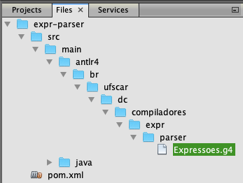

# Construção de Compiladores - Daniel Lucrédio, Helena Caseli, Mário César San Felice e Murilo Naldi
## Tópico 07 - Análise Semântica - Exemplos

### Demonstração 1 – Analisador semântico no ANTLR
---

1. Criar um novo arquivo, no Desktop, com um programa de exemplo

```
(34 - 3 + 2) * (41 + 3)
```

2. Criar um novo projeto Java Maven no NetBeans
- Project name: ```expr-parser```
- Group Id: ```br.ufscar.dc.compiladores```
- Modificar o arquivo pom.xml para incluir a dependência para o ANTLR e o plugin do ANTLR

```xml
<?xml version="1.0" encoding="UTF-8"?>
<project xmlns="http://maven.apache.org/POM/4.0.0" 
...
    <build>
        <plugins>
            <plugin>
                <groupId>org.antlr</groupId>
                <artifactId>antlr4-maven-plugin</artifactId>
                <version>4.7.2</version>
                <executions>
                    <execution>
                        <id>antlr</id>
                        <goals>
                            <goal>antlr4</goal>
                        </goals>
                    </execution>
                </executions>
            </plugin>            
            <plugin>
                <artifactId>maven-assembly-plugin</artifactId>
                <configuration>
                    <archive>
                        <manifest>
<mainClass>br.ufscar.dc.compiladores.expr.parser.Principal</mainClass>
                        </manifest>
                    </archive>
                    <descriptorRefs>
                        <descriptorRef>jar-with-dependencies</descriptorRef>
                    </descriptorRefs>
                </configuration>
                <executions>
                    <execution>
                        <id>make-assembly</id>
                        <phase>package</phase>
                        <goals>
                            <goal>single</goal>
                        </goals>
                    </execution>
                </executions>
            </plugin>
        </plugins>
    </build>
    <dependencies>
        <dependency>
            <groupId>org.antlr</groupId>
            <artifactId>antlr4</artifactId>
            <version>4.7.2</version>
            <classifier>complete</classifier>
        </dependency>
    </dependencies>    
</project>
```

3. Criar um novo arquivo do tipo ANTLR Grammar, chamado ```Expressoes.g4```

- O plugin ANTLR-Maven exige que o arquivo com a gramática seja incluído em um diretório específico dentro da pasta src/main do projeto. Esse diretório só pode ser criado na aba “arquivos/files” do NetBeans. Esse diretório deve se chamar “antlr4” e deve ter a mesma estrutura de diretórios que os pacotes Java. A figura a seguir ilustra o local exato onde deve ser criado o arquivo. Observe que é necessário alternar para a aba “arquivos/files” (topo da imagem):



- Ao retornar para a aba “projetos/projects” a nova estrutura de diretórios irá aparecer dentro de “other sources”
- O conteúdo do arquivo é o seguinte

```
grammar Expressoes;

programa returns [ int val ]
	:	expressao EOF { $val = $expressao.val; }
	;
	
expressao returns  [ int val ]
	:	termo expressao2[$termo.val] { $val = $expressao2.sint; }
	;
	
expressao2 [ int her ] returns [ int sint ]
	:	'+' termo exp=expressao2[$termo.val+$her] { $sint = $exp.sint; }
	|	'-' termo exp=expressao2[$her-$termo.val] { $sint = $exp.sint; }
	|	{ $sint = $her; }
	;
	
termo returns [ int val ]
	:	fator termo2[$fator.val] { $val = $termo2.sint; }
	;
	
termo2 [ int her ] returns [ int sint ]
	:	'*' fator term=termo2[$fator.val*$her] { $sint = $term.sint; }
	|	{ $sint = $her; }
	;
	
fator returns [ int val ]
	:	'(' expressao ')' { $val = $expressao.val; }
	|	NUM { $val = Integer.parseInt($NUM.getText()); }
	;

NUM	:	'0'..'9'+
	;
	
WS	:	( ' ' | '\n' | '\r' | '\t' ) { skip(); }
	;
```

4. Criar a classe Principal

```java
package br.ufscar.dc.compiladores.expr.parser;

import java.io.IOException;
import org.antlr.v4.runtime.CharStream;
import org.antlr.v4.runtime.CharStreams;
import org.antlr.v4.runtime.CommonTokenStream;

public class Principal {

    public static void main(String args[]) throws IOException {
        CharStream cs = CharStreams.fromFileName(args[0]);
        ExpressoesLexer lexer = new ExpressoesLexer(cs);
        CommonTokenStream tokens = new CommonTokenStream(lexer);
        ExpressoesParser parser = new ExpressoesParser(tokens);
        int val = parser.programa().val;
        System.out.println("Valor = " + val);

    }
}
```

- Compilar e executar, abrindo um comando no terminal (não esqueça de substituir os caminhos)

```sh
java -jar ~/NetBeansProjects/expr-parser/target/expr-parser-1.0-SNAPSHOT-jar-with-dependencies.jar ~/Desktop/exemplo.txt
```

5. Agora vamos fazer de um jeito mais simples
6. Repetir os passos 1 e 2 acima, criando um novo projeto com as mesmas configurações, mas com o nome ```expr-parser2``` (não esquecer que agora o pacote é ```br.ufscar.dc.compiladores.expr.parser2```)
7. O conteúdo da gramática agora é o seguinte:

```
grammar Expressoes;
programa:
    expressao EOF
;
expressao:
    termo1=termo (op1 outrosTermos+=termo)*
;
termo:
    fator1=fator (op2 outrosFatores+=fator)*
;       
fator:
    '(' expressao ')' |
    NUM
;
op1:
    '+' | '-'
;
op2:
    '*' | '/'
;
NUM:
    '0'..'9'+
;	
WS:
    ( ' ' | '\n' | '\r' | '\t' ) -> skip
;
```

8. Agora vamos solicitar que o plugin antlr-maven gere um código para visitante. Inserir as seguintes linhas destacadas no arquivo pom.xml e construir o projeto novamente:

```diff
<?xml version="1.0" encoding="UTF-8"?>
<project xmlns="http://maven.apache.org/POM/4.0.0" xmlns:xsi="http://www.w3.org/2001/XMLSchema-instance" xsi:schemaLocation="http://maven.apache.org/POM/4.0.0 http://maven.apache.org/xsd/maven-4.0.0.xsd">
    <modelVersion>4.0.0</modelVersion>
    <groupId>br.ufscar.dc.compiladores</groupId>
    <artifactId>expr-parser2</artifactId>
    <version>1.0-SNAPSHOT</version>
    <packaging>jar</packaging>
    <properties>
        <project.build.sourceEncoding>UTF-8</project.build.sourceEncoding>
        <maven.compiler.source>11</maven.compiler.source>
        <maven.compiler.target>11</maven.compiler.target>
    </properties>
    <build>
        <plugins>
            <plugin>
                <groupId>org.antlr</groupId>
                <artifactId>antlr4-maven-plugin</artifactId>
                <version>4.7.2</version>
+                <configuration>
+                    <visitor>true</visitor>
+                </configuration>
                <executions>
                    <execution>
                        <id>antlr</id>
                        <goals>
                            <goal>antlr4</goal>
                        </goals>
                    </execution>
                </executions>
            </plugin>            
            <plugin>
                <artifactId>maven-assembly-plugin</artifactId>
                <configuration>
                    <archive>
                        <manifest>
<mainClass>br.ufscar.dc.compiladores.expr.parser2.Principal</mainClass>
                        </manifest>
                    </archive>
                    <descriptorRefs>
                        <descriptorRef>jar-with-dependencies</descriptorRef>
                    </descriptorRefs>
                </configuration>
                <executions>
                    <execution>
                        <id>make-assembly</id>
                        <phase>package</phase>
                        <goals>
                            <goal>single</goal>
                        </goals>
                    </execution>
                </executions>
            </plugin>
        </plugins>
    </build>
    <dependencies>
        <dependency>
            <groupId>org.antlr</groupId>
            <artifactId>antlr4</artifactId>
            <version>4.7.2</version>
            <classifier>complete</classifier>
        </dependency>
    </dependencies>     
</project>
```

9. Criar uma classe Calculador

```java
package br.ufscar.dc.compiladores.expr.parser2;

import br.ufscar.dc.compiladores.expr.parser2.ExpressoesParser.FatorContext;
import br.ufscar.dc.compiladores.expr.parser2.ExpressoesParser.TermoContext;

public class Calculador extends ExpressoesBaseVisitor<Double> {

    @Override
    public Double visitPrograma(ExpressoesParser.ProgramaContext ctx) {
        return visitExpressao(ctx.expressao());
    }

    @Override
    public Double visitExpressao(ExpressoesParser.ExpressaoContext ctx) {
        double valor = visitTermo(ctx.termo1);
        for (int i = 0; i < ctx.outrosTermos.size(); i++) {
            ExpressoesParser.Op1Context op1 = ctx.op1(i);
            TermoContext ot = ctx.outrosTermos.get(i);
            String strOp1 = op1.getText();
            if (strOp1.equals("+")) {
                valor += visitTermo(ot);
            } else {
                valor -= visitTermo(ot);
            }
        }
        return valor;
    }

    @Override
    public Double visitTermo(ExpressoesParser.TermoContext ctx) {
        double valor = visitFator(ctx.fator1);
        for (int i = 0; i < ctx.outrosFatores.size(); i++) {
            ExpressoesParser.Op2Context op2 = ctx.op2(i);
            FatorContext of = ctx.outrosFatores.get(i);
            String strOp2 = op2.getText();
            if (strOp2.equals("*")) {
                valor *= visitFator(of);
            } else {
                valor /= visitFator(of);
            }
        }
        return valor;
    }

    @Override
    public Double visitFator(ExpressoesParser.FatorContext ctx) {
        if (ctx.NUM() != null) {
            return Double.parseDouble(ctx.NUM().getText());
        } else {
            return visitExpressao(ctx.expressao());
        }
    }
}
```

10. Executar com o seguinte código na classe Principal

```java
package br.ufscar.dc.compiladores.expr.parser2;

import java.io.IOException;
import org.antlr.v4.runtime.CharStream;
import org.antlr.v4.runtime.CharStreams;
import org.antlr.v4.runtime.CommonTokenStream;

public class Principal {

    public static void main(String args[]) throws IOException {
        CharStream cs = CharStreams.fromFileName(args[0]);
        ExpressoesLexer lexer = new ExpressoesLexer(cs);
        CommonTokenStream tokens = new CommonTokenStream(lexer);
        ExpressoesParser parser = new ExpressoesParser(tokens);
        ExpressoesParser.ProgramaContext arvore = parser.programa();
        Calculador c = new Calculador();
        double val = c.visitPrograma(arvore);
        System.out.println("Valor2 = " + val);
    }
}
```

### Demonstração 2 – Uso da tabela de símbolos
---

1. Criar um novo arquivo, no Desktop, com um programa de exemplo

```
let x=2+1, y=3+4 in x+y
```

2. Abrir o NetBeans, e repetir os passos de criação de projeto da demonstração anterior, e criar um projeto chamado ```expr-parser3``` (inclusive a opção para gerar Visitor)
3. Criar classe ```EntradaTabelaDeSimbolos```

```java
package br.ufscar.dc.compiladores.expr.parser3;

public class EntradaTabelaDeSimbolos {
    public String nome;
    public double valor;
}
```

4. Criar classe ```TabelaDeSimbolos```

```java
package br.ufscar.dc.compiladores.expr.parser3;

import java.util.HashMap;

public class TabelaDeSimbolos {

    private HashMap<String, EntradaTabelaDeSimbolos> tabelaDeSimbolos;

    public TabelaDeSimbolos() {
        tabelaDeSimbolos = new HashMap<>();
    }

    public void inserir(String nome, double valor) {
        EntradaTabelaDeSimbolos etds = new EntradaTabelaDeSimbolos();
        etds.nome = nome;
        etds.valor = valor;
        tabelaDeSimbolos.put(nome, etds);
    }

    public EntradaTabelaDeSimbolos verificar(String nome) {
        return tabelaDeSimbolos.get(nome);
    }
}
```

5. Criar classe ```Escopos```

```java
package br.ufscar.dc.compiladores.expr.parser3;

import java.util.LinkedList;
import java.util.List;

public class Escopos {

    private LinkedList<TabelaDeSimbolos> pilhaDeTabelas;

    public Escopos() {
        pilhaDeTabelas = new LinkedList<>();
        criarNovoEscopo();
    }

    public void criarNovoEscopo() {
        pilhaDeTabelas.push(new TabelaDeSimbolos());
    }

    public TabelaDeSimbolos obterEscopoAtual() {
        return pilhaDeTabelas.peek();
    }

    public List<TabelaDeSimbolos> percorrerEscoposAninhados() {
        return pilhaDeTabelas;
    }

    public void abandonarEscopo() {
        pilhaDeTabelas.pop();
    }
}
```

6. Criar a seguinte gramática

```
grammar Expressoes;

programa:
    exp
;

exp:
    termo1=termo ('+' outrosTermos+=termo)*
;

termo:
    '(' expParentesis=exp ')' |
    variavel=ID |
    constante=INT | 
    'let' listaDecl 'in' subexp=exp
;

listaDecl:
    decl (',' decl)*
;

decl:
    nome=ID '=' exp 
;

ID  :	('a'..'z'|'A'..'Z'|'_') ('a'..'z'|'A'..'Z'|'0'..'9'|'_')*;
INT :	'0'..'9'+;
WS  :   ( ' '
        | '\t'
        | '\r'
        | '\n'
        ) -> skip
;
```

7. Compilar o projeto (será gerado o BaseVisitor) e criar a seguinte classe:

```java
package br.ufscar.dc.compiladores.expr.parser3;

import br.ufscar.dc.compiladores.expr.parser3.ExpressoesParser.DeclContext;
import br.ufscar.dc.compiladores.expr.parser3.ExpressoesParser.TermoContext;
import java.util.List;

public class Calculador extends ExpressoesBaseVisitor<Double> {

    Escopos escoposAninhados = new Escopos();

    @Override
    public Double visitPrograma(ExpressoesParser.ProgramaContext ctx) {
        return visitExp(ctx.exp());
    }

    @Override
    public Double visitExp(ExpressoesParser.ExpContext ctx) {
        double valor = visitTermo(ctx.termo1);
        for (TermoContext ot : ctx.outrosTermos) {
            valor += visitTermo(ot);
        }
        return valor;
    }

    @Override
    public Double visitTermo(ExpressoesParser.TermoContext ctx) {
        if (ctx.expParentesis != null) {
            return visitExp(ctx.expParentesis);
        } else if (ctx.constante != null) {
            return Double.parseDouble(ctx.constante.getText());
        } else if (ctx.variavel != null) {
            List<TabelaDeSimbolos> escopos = escoposAninhados.percorrerEscoposAninhados();
            for (TabelaDeSimbolos ts : escopos) {
                EntradaTabelaDeSimbolos etds = ts.verificar(ctx.variavel.getText());
                if (etds != null) {
                    return etds.valor;
                }
            }
            throw new RuntimeException("Erro semântico: "
                    + ctx.variavel.getText() + " não foi declarada antes do uso");
        } else {
            escoposAninhados.criarNovoEscopo();
            visitListaDecl(ctx.listaDecl());
            double retorno = visitExp(ctx.subexp);
            escoposAninhados.abandonarEscopo();
            return retorno;
        }
    }

    @Override
    public Double visitDecl(ExpressoesParser.DeclContext ctx) {
        TabelaDeSimbolos escopoAtual = escoposAninhados.obterEscopoAtual();
        if (escopoAtual.verificar(ctx.nome.getText()) != null) {
            throw new RuntimeException("Erro semântico: " + ctx.nome.getText()
                    + " declarada duas vezes num mesmo escopo");
        } else {
            escopoAtual.inserir(ctx.nome.getText(), visitExp(ctx.exp()));
        }

        return null; // declaração não tem valor
    }

    @Override
    public Double visitListaDecl(ExpressoesParser.ListaDeclContext ctx) {
        for (DeclContext d : ctx.decl()) {
            visitDecl(d);
        }
        return null; // declaração não tem valor
    }
}
```

8. Criar o seguinte código na classe principal

```java
package br.ufscar.dc.compiladores.expr.parser3;

import br.ufscar.dc.compiladores.expr.parser3.ExpressoesParser.ProgramaContext;
import java.io.IOException;
import org.antlr.v4.runtime.CharStream;
import org.antlr.v4.runtime.CharStreams;
import org.antlr.v4.runtime.CommonTokenStream;

public class Principal {

    public static void main(String args[]) throws IOException {
        CharStream cs = CharStreams.fromFileName(args[0]);
        ExpressoesLexer lexer = new ExpressoesLexer(cs);
        CommonTokenStream tokens = new CommonTokenStream(lexer);
        ExpressoesParser parser = new ExpressoesParser(tokens);
        ProgramaContext arvore = parser.programa();
        Calculador c = new Calculador();
        double val = c.visitPrograma(arvore);
        System.out.println("Valor calculado: " + val);

    }
}
```

9. Testar com vários programas

```
let x=2+1, y=3+4 in x+y // valor=10
```

```
let x=2, y=3 in
    (let x=x+1, y=(let z=3, x=4 in x+y+z)
     in (x+y)
    ) // valor=13
```

```
let x=2,y=x+1 in (let x=x+y,y=x+y in y) // valor=8
```

```
let x=2,x=3 in x+1 // x declarada duas vezes
```

```
let x=2 in x+y // y não declarada
```

```
let x=2 in (let x=3 in x) //valor=3
```

```
let x=2+1, y=(let z=3 in z+x) in let z=4 in x+y+z //valor=13
```

### Demonstração 3 – Analisador semântico com verificação de tipos – ANTLR
---

1. Criar um novo arquivo no Desktop

```
:DECLARACOES
numero1:INTEIRO
numero2:INTEIRO
numero3:INTEIRO
%numero4:INTEIRO
aux:INTEIRO

:ALGORITMO
% Coloca 3 números em ordem crescente
LER numero1
LER numero2
LER numero3
SE numero1 > numero2 ENTAO
   INICIO
      ATRIBUIR 2+3-4+5-6*5-1 A aux
      ATRIBUIR numero1 A numero2
      ATRIBUIR aux A numero1
   FIM 
SE numero1 > numero3 E numero2 <= numero4 E numero1 > 3 OU numero2 <> numero4 ENTAO
   INICIO
      ATRIBUIR (numero3) A aux
      ATRIBUIR numero1 A numero3
      ATRIBUIR aux A numero1
   FIM
SE numero2 > numero3 ENTAO
   INICIO
      ATRIBUIR numero3 A aux
      ATRIBUIR numero2 A numero3
      ATRIBUIR aux A numero2
   FIM
IMPRIMIR numero1
IMPRIMIR numero5 + 3
IMPRIMIR 2 + 2.4
IMPRIMIR 'FIM'
```

2. Seguir os mesmos passos anteriores e criar novo projeto Java Maven, com opção de visitor, chamado ```alguma-semantico```
3. Criar a seguinte gramática no arquivo ```Alguma.g4``` (utilizar a mesma estrutura de diretórios dos exemplos anteriores)

```
grammar Alguma;

TIPO_VAR: 'INTEIRO' | 'REAL';
NUMINT: ('0'..'9')+;
NUMREAL: ('0'..'9')+ '.' ('0'..'9')+;
CADEIA:'\'' ( ESC_SEQ | ~('\''|'\\') )* '\'';
fragment
ESC_SEQ: '\\\'';
OP_ARIT1: '+' | '-';
OP_ARIT2: '*' | '/';
OP_REL: '>' | '>=' | '<' | '<=' | '<>' | '=';
OP_BOOL: 'E' | 'OU';
VARIAVEL: ('a'..'z'|'A'..'Z') ('a'..'z'|'A'..'Z'|'0'..'9')*;
COMENTARIO:'%' ~('\n'|'\r')* '\r'? '\n' -> skip;
WS: ( ' ' |'\t' | '\r' | '\n') -> skip;
	
programa: ':' 'DECLARACOES' declaracao* ':' 'ALGORITMO' comando* EOF;
declaracao: VARIAVEL ':' TIPO_VAR;
expressaoAritmetica: termoAritmetico (OP_ARIT1 termoAritmetico)*;
termoAritmetico: fatorAritmetico (OP_ARIT2 fatorAritmetico)*;
fatorAritmetico: NUMINT | NUMREAL | VARIAVEL | '(' expressaoAritmetica ')';
expressaoRelacional: termoRelacional (OP_BOOL termoRelacional)*;
termoRelacional: expressaoAritmetica OP_REL expressaoAritmetica | '(' expressaoRelacional ')';
comando: comandoAtribuicao | comandoEntrada | comandoSaida | comandoCondicao | comandoRepeticao |	subAlgoritmo;
comandoAtribuicao: 'ATRIBUIR' expressaoAritmetica 'A' VARIAVEL;
comandoEntrada: 'LER' VARIAVEL;
comandoSaida: 'IMPRIMIR' (expressaoAritmetica | CADEIA);
comandoCondicao: 'SE' expressaoRelacional 'ENTAO' comando ('SENAO' comando)?;
comandoRepeticao: 'ENQUANTO' expressaoRelacional comando;
subAlgoritmo: 'INICIO' comando* 'FIM';
```

4. Compilar o projeto (será gerado o BaseVisitor) e criar as seguintes classes:

- ```TabelaDeSimbolos```

```java
package br.ufscar.dc.compiladores.alguma.semantico;

import java.util.HashMap;
import java.util.Map;

public class TabelaDeSimbolos {
    public enum TipoAlguma {
        INTEIRO,
        REAL,
        INVALIDO
    }
    
    class EntradaTabelaDeSimbolos {
        String nome;
        TipoAlguma tipo;

        private EntradaTabelaDeSimbolos(String nome, TipoAlguma tipo) {
            this.nome = nome;
            this.tipo = tipo;
        }
    }
    
    private final Map<String, EntradaTabelaDeSimbolos> tabela;
    
    public TabelaDeSimbolos() {
        this.tabela = new HashMap<>();
    }
    
    public void adicionar(String nome, TipoAlguma tipo) {
        tabela.put(nome, new EntradaTabelaDeSimbolos(nome, tipo));
    }
    
    public boolean existe(String nome) {
        return tabela.containsKey(nome);
    }
    
    public TipoAlguma verificar(String nome) {
        return tabela.get(nome).tipo;
    }
}
```

- ```AlgumaSemanticoUtils```

```java
package br.ufscar.dc.compiladores.alguma.semantico;

import java.util.ArrayList;
import java.util.List;
import org.antlr.v4.runtime.Token;

public class AlgumaSemanticoUtils {
    public static List<String> errosSemanticos = new ArrayList<>();
    
    public static void adicionarErroSemantico(Token t, String mensagem) {
        int linha = t.getLine();
        int coluna = t.getCharPositionInLine();
        errosSemanticos.add(String.format("Erro %d:%d - %s", linha, coluna, mensagem));
    }
    
    public static TabelaDeSimbolos.TipoAlguma verificarTipo(TabelaDeSimbolos tabela, AlgumaParser.ExpressaoAritmeticaContext ctx) {
        TabelaDeSimbolos.TipoAlguma ret = null;
        for (var ta : ctx.termoAritmetico()) {
            TabelaDeSimbolos.TipoAlguma aux = verificarTipo(tabela, ta);
            if (ret == null) {
                ret = aux;
            } else if (ret != aux && aux != TabelaDeSimbolos.TipoAlguma.INVALIDO) {
                adicionarErroSemantico(ctx.start, "Expressão " + ctx.getText() + " contém tipos incompatíveis");
                ret = TabelaDeSimbolos.TipoAlguma.INVALIDO;
            }
        }

        return ret;
    }

    public static TabelaDeSimbolos.TipoAlguma verificarTipo(TabelaDeSimbolos tabela, AlgumaParser.TermoAritmeticoContext ctx) {
        TabelaDeSimbolos.TipoAlguma ret = null;

        for (var fa : ctx.fatorAritmetico()) {
            TabelaDeSimbolos.TipoAlguma aux = verificarTipo(tabela, fa);
            if (ret == null) {
                ret = aux;
            } else if (ret != aux && aux != TabelaDeSimbolos.TipoAlguma.INVALIDO) {
                adicionarErroSemantico(ctx.start, "Termo " + ctx.getText() + " contém tipos incompatíveis");
                ret = TabelaDeSimbolos.TipoAlguma.INVALIDO;
            }
        }
        return ret;
    }

    public static TabelaDeSimbolos.TipoAlguma verificarTipo(TabelaDeSimbolos tabela, AlgumaParser.FatorAritmeticoContext ctx) {
        if (ctx.NUMINT() != null) {
            return TabelaDeSimbolos.TipoAlguma.INTEIRO;
        }
        if (ctx.NUMREAL() != null) {
            return TabelaDeSimbolos.TipoAlguma.REAL;
        }
        if (ctx.VARIAVEL() != null) {
            String nomeVar = ctx.VARIAVEL().getText();
            if (!tabela.existe(nomeVar)) {
                adicionarErroSemantico(ctx.VARIAVEL().getSymbol(), "Variável " + nomeVar + " não foi declarada antes do uso");
                return TabelaDeSimbolos.TipoAlguma.INVALIDO;
            }
            return verificarTipo(tabela, nomeVar);
        }
        // se não for nenhum dos tipos acima, só pode ser uma expressão
        // entre parêntesis
        return verificarTipo(tabela, ctx.expressaoAritmetica());
    }
    
    public static TabelaDeSimbolos.TipoAlguma verificarTipo(TabelaDeSimbolos tabela, String nomeVar) {
        return tabela.verificar(nomeVar);
    }
}
```

- ```AlgumaSemantico```

```java
package br.ufscar.dc.compiladores.alguma.semantico;

import br.ufscar.dc.compiladores.alguma.semantico.TabelaDeSimbolos.TipoAlguma;

public class AlgumaSemantico extends AlgumaBaseVisitor<Void> {

    TabelaDeSimbolos tabela;

    @Override
    public Void visitPrograma(AlgumaParser.ProgramaContext ctx) {
        tabela = new TabelaDeSimbolos();
        return super.visitPrograma(ctx);
    }

    @Override
    public Void visitDeclaracao(AlgumaParser.DeclaracaoContext ctx) {
        String nomeVar = ctx.VARIAVEL().getText();
        String strTipoVar = ctx.TIPO_VAR().getText();
        TipoAlguma tipoVar = TipoAlguma.INVALIDO;
        switch (strTipoVar) {
            case "INTEIRO":
                tipoVar = TipoAlguma.INTEIRO;
                break;
            case "REAL":
                tipoVar = TipoAlguma.REAL;
                break;
            default:
                // Nunca irá acontecer, pois o analisador sintático
                // não permite
                break;
        }

        // Verificar se a variável já foi declarada
        if (tabela.existe(nomeVar)) {
            AlgumaSemanticoUtils.adicionarErroSemantico(ctx.VARIAVEL().getSymbol(), "Variável " + nomeVar + " já existe");
        } else {
            tabela.adicionar(nomeVar, tipoVar);
        }

        return super.visitDeclaracao(ctx);
    }

    @Override
    public Void visitComandoAtribuicao(AlgumaParser.ComandoAtribuicaoContext ctx) {
        TipoAlguma tipoExpressao = AlgumaSemanticoUtils.verificarTipo(tabela, ctx.expressaoAritmetica());
        if (tipoExpressao != TipoAlguma.INVALIDO) {
            String nomeVar = ctx.VARIAVEL().getText();
            if (!tabela.existe(nomeVar)) {
                AlgumaSemanticoUtils.adicionarErroSemantico(ctx.VARIAVEL().getSymbol(), "Variável " + nomeVar + " não foi declarada antes do uso");
            } else {
                TipoAlguma tipoVariavel = AlgumaSemanticoUtils.verificarTipo(tabela, nomeVar);
                if (tipoVariavel != tipoExpressao && tipoExpressao != TipoAlguma.INVALIDO) {
                    AlgumaSemanticoUtils.adicionarErroSemantico(ctx.VARIAVEL().getSymbol(), "Tipo da variável " + nomeVar + " não é compatível com o tipo da expressão");
                }
            }
        }
        return super.visitComandoAtribuicao(ctx);
    }

    @Override
    public Void visitComandoEntrada(AlgumaParser.ComandoEntradaContext ctx) {
        String nomeVar = ctx.VARIAVEL().getText();
        if (!tabela.existe(nomeVar)) {
            AlgumaSemanticoUtils.adicionarErroSemantico(ctx.VARIAVEL().getSymbol(), "Variável " + nomeVar + " não foi declarada antes do uso");
        }
        return super.visitComandoEntrada(ctx);
    }

    @Override
    public Void visitExpressaoAritmetica(AlgumaParser.ExpressaoAritmeticaContext ctx) {
        AlgumaSemanticoUtils.verificarTipo(tabela, ctx);
        return super.visitExpressaoAritmetica(ctx);
    }
}
```

5. Criar a classe ```Principal```:

```java
package br.ufscar.dc.compiladores.alguma.gerador;

import br.ufscar.dc.compiladores.alguma.gerador.AlgumaParser.ProgramaContext;
import java.io.IOException;
import java.io.PrintWriter;
import org.antlr.v4.runtime.CharStream;
import org.antlr.v4.runtime.CharStreams;
import org.antlr.v4.runtime.CommonTokenStream;

public class Principal {
    public static void main(String args[]) throws IOException {
        CharStream cs = CharStreams.fromFileName(args[0]);
        AlgumaLexer lexer = new AlgumaLexer(cs);
        CommonTokenStream tokens = new CommonTokenStream(lexer);
        AlgumaParser parser = new AlgumaParser(tokens);
        ProgramaContext arvore = parser.programa();
        AlgumaSemantico as = new AlgumaSemantico();
        as.visitPrograma(arvore);
        AnalisadorSemanticoUtils.errosSemanticos.forEach((s) -> System.out.println(s));
    }
}
```

6. Compilar e testar
