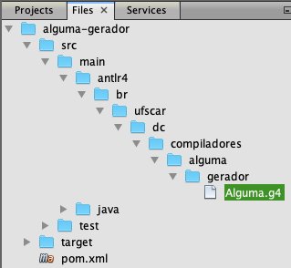

# Construção de Compiladores - Daniel Lucrédio, Helena Caseli, Mário César San Felice e Murilo Naldi
## Tópico 07 - Geração de Código - Exemplos

### Demonstração 1 – Gerador de código C
---

1. Criar um arquivo de teste no Desktop

```
:DECLARACOES
num:INTEIRO
potencia:INTEIRO
aux:INTEIRO
resultado:INTEIRO
:ALGORITMO
LER num
LER potencia
SE potencia = 0
ENTAO
   ATRIBUIR 1 A resultado
SENAO
   INICIO
      ATRIBUIR num A resultado
      ATRIBUIR 1 A aux
      ENQUANTO aux < potencia
         INICIO
            ATRIBUIR resultado * num A resultado
            ATRIBUIR aux + 1 A aux
         FIM
   FIM
IMPRIMIR 'O resultado é:'
IMPRIMIR resultado
```

2. Criar um novo projeto Java Maven no NetBeans
- Project name: ```alguma-gerador```
- Group Id: ```br.ufscar.dc.compiladores```
- Modificar o arquivo pom.xml para incluir a dependência para o ANTLR e o plugin do ANTLR

```xml
<?xml version="1.0" encoding="UTF-8"?>
<project xmlns="http://maven.apache.org/POM/4.0.0" 
...
    <build>
        <plugins>
            <plugin>
                <groupId>org.antlr</groupId>
                <artifactId>antlr4-maven-plugin</artifactId>
                <version>4.7.2</version>
                <configuration>
                    <visitor>true</visitor>
                </configuration>
                <executions>
                    <execution>
                        <id>antlr</id>
                        <goals>
                            <goal>antlr4</goal>
                        </goals>
                    </execution>
                </executions>
            </plugin>            
            <plugin>
                <artifactId>maven-assembly-plugin</artifactId>
                <configuration>
                    <archive>
                        <manifest>
<mainClass>br.ufscar.dc.compiladores.alguma.gerador.Principal</mainClass>
                        </manifest>
                    </archive>
                    <descriptorRefs>
                        <descriptorRef>jar-with-dependencies</descriptorRef>
                    </descriptorRefs>
                </configuration>
                <executions>
                    <execution>
                        <id>make-assembly</id>
                        <phase>package</phase>
                        <goals>
                            <goal>single</goal>
                        </goals>
                    </execution>
                </executions>
            </plugin>
        </plugins>
    </build>
    <dependencies>
        <dependency>
            <groupId>org.antlr</groupId>
            <artifactId>antlr4</artifactId>
            <version>4.7.2</version>
            <classifier>complete</classifier>
        </dependency>
    </dependencies>      
</project>
```

3. Criar um novo arquivo do tipo ANTLR Grammar, chamado ```Alguma.g4```

- O plugin ANTLR-Maven exige que o arquivo com a gramática seja incluído em um diretório específico dentro da pasta src/main do projeto. Esse diretório só pode ser criado na aba “arquivos/files” do NetBeans. Esse diretório deve se chamar “antlr4” e deve ter a mesma estrutura de diretórios que os pacotes Java. A figura a seguir ilustra o local exato onde deve ser criado o arquivo. Observe que é necessário alternar para a aba “arquivos/files” (topo da imagem):



- Ao retornar para a aba “projetos/projects” a nova estrutura de diretórios irá aparecer dentro de “other sources”

- O conteúdo do arquivo é o seguinte (é a mesma gramática que o analisador semântico - aula 07)

```
grammar Alguma;

TIPO_VAR: 'INTEIRO' | 'REAL';
NUMINT: ('0'..'9')+;
NUMREAL: ('0'..'9')+ '.' ('0'..'9')+;
CADEIA:'\'' ( ESC_SEQ | ~('\''|'\\') )* '\'';
fragment
ESC_SEQ: '\\\'';
OP_ARIT1: '+' | '-';
OP_ARIT2: '*' | '/';
OP_REL: '>' | '>=' | '<' | '<=' | '<>' | '=';
OP_BOOL: 'E' | 'OU';
VARIAVEL: ('a'..'z'|'A'..'Z') ('a'..'z'|'A'..'Z'|'0'..'9')*;
COMENTARIO:'%' ~('\n'|'\r')* '\r'? '\n' -> skip;
WS: ( ' ' |'\t' | '\r' | '\n') -> skip;
	
programa: ':' 'DECLARACOES' declaracao* ':' 'ALGORITMO' comando* EOF;
declaracao: VARIAVEL ':' TIPO_VAR;
expressaoAritmetica: termoAritmetico (OP_ARIT1 termoAritmetico)*;
termoAritmetico: fatorAritmetico (OP_ARIT2 fatorAritmetico)*;
fatorAritmetico: NUMINT | NUMREAL | VARIAVEL | '(' expressaoAritmetica ')';
expressaoRelacional: termoRelacional (OP_BOOL termoRelacional)*;
termoRelacional: expressaoAritmetica OP_REL expressaoAritmetica | '(' expressaoRelacional ')';
comando: comandoAtribuicao | comandoEntrada | comandoSaida | comandoCondicao | comandoRepeticao |	subAlgoritmo;
comandoAtribuicao: 'ATRIBUIR' expressaoAritmetica 'A' VARIAVEL;
comandoEntrada: 'LER' VARIAVEL;
comandoSaida: 'IMPRIMIR' (expressaoAritmetica | CADEIA);
comandoCondicao: 'SE' expressaoRelacional 'ENTAO' comando ('SENAO' comando)?;
comandoRepeticao: 'ENQUANTO' expressaoRelacional comando;
subAlgoritmo: 'INICIO' comando* 'FIM';
```

4. Compilar o projeto e criar as seguintes classes (são as mesmas do analisador semântico - aula 07 - que vamos reaproveitar)

- ```TabelaDeSimbolos```

```java
package br.ufscar.dc.compiladores.alguma.gerador;

import java.util.HashMap;
import java.util.Map;

public class TabelaDeSimbolos {
    public enum TipoAlguma {
        INTEIRO,
        REAL,
        INVALIDO
    }
    
    class EntradaTabelaDeSimbolos {
        String nome;
        TipoAlguma tipo;

        private EntradaTabelaDeSimbolos(String nome, TipoAlguma tipo) {
            this.nome = nome;
            this.tipo = tipo;
        }
  `  }
    
    private final Map<String, EntradaTabelaDeSimbolos> tabela;
    
    public TabelaDeSimbolos() {
        this.tabela = new HashMap<>();
    }
    
    public void adicionar(String nome, TipoAlguma tipo) {
        tabela.put(nome, new EntradaTabelaDeSimbolos(nome, tipo));
    }
    
    public boolean existe(String nome) {
        return tabela.containsKey(nome);
    }
    
    public TipoAlguma verificar(String nome) {
        return tabela.get(nome).tipo;
    }
}
```

- ```AlgumaSemanticoUtils```

```java
package br.ufscar.dc.compiladores.alguma.gerador;

import java.util.ArrayList;
import java.util.List;
import org.antlr.v4.runtime.Token;

public class AlgumaSemanticoUtils {
    public static List<String> errosSemanticos = new ArrayList<>();
    
    public static void adicionarErroSemantico(Token t, String mensagem) {
        int linha = t.getLine();
        int coluna = t.getCharPositionInLine();
        errosSemanticos.add(String.format("Erro %d:%d - %s", linha, coluna, mensagem));
    }
    
    public static TabelaDeSimbolos.TipoAlguma verificarTipo(TabelaDeSimbolos tabela, AlgumaParser.ExpressaoAritmeticaContext ctx) {
        TabelaDeSimbolos.TipoAlguma ret = null;
        for (var ta : ctx.termoAritmetico()) {
            TabelaDeSimbolos.TipoAlguma aux = verificarTipo(tabela, ta);
            if (ret == null) {
                ret = aux;
            } else if (ret != aux && aux != TabelaDeSimbolos.TipoAlguma.INVALIDO) {
                adicionarErroSemantico(ctx.start, "Expressão " + ctx.getText() + " contém tipos incompatíveis");
                ret = TabelaDeSimbolos.TipoAlguma.INVALIDO;
            }
        }

        return ret;
    }

    public static TabelaDeSimbolos.TipoAlguma verificarTipo(TabelaDeSimbolos tabela, AlgumaParser.TermoAritmeticoContext ctx) {
        TabelaDeSimbolos.TipoAlguma ret = null;

        for (var fa : ctx.fatorAritmetico()) {
            TabelaDeSimbolos.TipoAlguma aux = verificarTipo(tabela, fa);
            if (ret == null) {
                ret = aux;
            } else if (ret != aux && aux != TabelaDeSimbolos.TipoAlguma.INVALIDO) {
                adicionarErroSemantico(ctx.start, "Termo " + ctx.getText() + " contém tipos incompatíveis");
                ret = TabelaDeSimbolos.TipoAlguma.INVALIDO;
            }
        }
        return ret;
    }

    public static TabelaDeSimbolos.TipoAlguma verificarTipo(TabelaDeSimbolos tabela, AlgumaParser.FatorAritmeticoContext ctx) {
        if (ctx.NUMINT() != null) {
            return TabelaDeSimbolos.TipoAlguma.INTEIRO;
        }
        if (ctx.NUMREAL() != null) {
            return TabelaDeSimbolos.TipoAlguma.REAL;
        }
        if (ctx.VARIAVEL() != null) {
            String nomeVar = ctx.VARIAVEL().getText();
            if (!tabela.existe(nomeVar)) {
                adicionarErroSemantico(ctx.VARIAVEL().getSymbol(), "Variável " + nomeVar + " não foi declarada antes do uso");
                return TabelaDeSimbolos.TipoAlguma.INVALIDO;
            }
            return verificarTipo(tabela, nomeVar);
        }
        // se não for nenhum dos tipos acima, só pode ser uma expressão
        // entre parêntesis
        return verificarTipo(tabela, ctx.expressaoAritmetica());
    }
    
    public static TabelaDeSimbolos.TipoAlguma verificarTipo(TabelaDeSimbolos tabela, String nomeVar) {
        return tabela.verificar(nomeVar);
    }
}
```

- ```AlgumaSemantico```

```java
package br.ufscar.dc.compiladores.alguma.gerador;

import br.ufscar.dc.compiladores.alguma.gerador.TabelaDeSimbolos.TipoAlguma;

public class AlgumaSemantico extends AlgumaBaseVisitor<Void> {

    TabelaDeSimbolos tabela;

    @Override
    public Void visitPrograma(AlgumaParser.ProgramaContext ctx) {
        tabela = new TabelaDeSimbolos();
        return super.visitPrograma(ctx);
    }

    @Override
    public Void visitDeclaracao(AlgumaParser.DeclaracaoContext ctx) {
        String nomeVar = ctx.VARIAVEL().getText();
        String strTipoVar = ctx.TIPO_VAR().getText();
        TipoAlguma tipoVar = TipoAlguma.INVALIDO;
        switch (strTipoVar) {
            case "INTEIRO":
                tipoVar = TipoAlguma.INTEIRO;
                break;
            case "REAL":
                tipoVar = TipoAlguma.REAL;
                break;
            default:
                // Nunca irá acontecer, pois o analisador sintático
                // não permite
                break;
        }

        // Verificar se a variável já foi declarada
        if (tabela.existe(nomeVar)) {
            AlgumaSemanticoUtils.adicionarErroSemantico(ctx.VARIAVEL().getSymbol(), "Variável " + nomeVar + " já existe");
        } else {
            tabela.adicionar(nomeVar, tipoVar);
        }

        return super.visitDeclaracao(ctx);
    }

    @Override
    public Void visitComandoAtribuicao(AlgumaParser.ComandoAtribuicaoContext ctx) {
        TipoAlguma tipoExpressao = AlgumaSemanticoUtils.verificarTipo(tabela, ctx.expressaoAritmetica());
        if (tipoExpressao != TipoAlguma.INVALIDO) {
            String nomeVar = ctx.VARIAVEL().getText();
            if (!tabela.existe(nomeVar)) {
                AlgumaSemanticoUtils.adicionarErroSemantico(ctx.VARIAVEL().getSymbol(), "Variável " + nomeVar + " não foi declarada antes do uso");
            } else {
                TipoAlguma tipoVariavel = AlgumaSemanticoUtils.verificarTipo(tabela, nomeVar);
                if (tipoVariavel != tipoExpressao && tipoExpressao != TipoAlguma.INVALIDO) {
                    AlgumaSemanticoUtils.adicionarErroSemantico(ctx.VARIAVEL().getSymbol(), "Tipo da variável " + nomeVar + " não é compatível com o tipo da expressão");
                }
            }
        }
        return super.visitComandoAtribuicao(ctx);
    }

    @Override
    public Void visitComandoEntrada(AlgumaParser.ComandoEntradaContext ctx) {
        String nomeVar = ctx.VARIAVEL().getText();
        if (!tabela.existe(nomeVar)) {
            AlgumaSemanticoUtils.adicionarErroSemantico(ctx.VARIAVEL().getSymbol(), "Variável " + nomeVar + " não foi declarada antes do uso");
        }
        return super.visitComandoEntrada(ctx);
    }

    @Override
    public Void visitExpressaoAritmetica(AlgumaParser.ExpressaoAritmeticaContext ctx) {
        AlgumaSemanticoUtils.verificarTipo(tabela, ctx);
        return super.visitExpressaoAritmetica(ctx);
    }
}
```

5. Vamos agora criar o gerador (um visitante)

```java
package br.ufscar.dc.compiladores.alguma.gerador;

import br.ufscar.dc.compiladores.alguma.gerador.TabelaDeSimbolos.TipoAlguma;

public class AlgumaGeradorC extends AlgumaBaseVisitor<Void> {

    StringBuilder saida;
    TabelaDeSimbolos tabela;

    public AlgumaGeradorC() {
        saida = new StringBuilder();
        this.tabela = new TabelaDeSimbolos();
    }

    @Override
    public Void visitPrograma(AlgumaParser.ProgramaContext ctx) {
        saida.append("#include <stdio.h>\n");
        saida.append("#include <stdlib.h>\n");
        saida.append("\n");
        ctx.declaracao().forEach(dec -> visitDeclaracao(dec));
        saida.append("\n");
        saida.append("int main() {\n");
        ctx.comando().forEach(cmd -> visitComando(cmd));
        saida.append("}\n");
        return null;
    }

    @Override
    public Void visitDeclaracao(AlgumaParser.DeclaracaoContext ctx) {
        String nomeVar = ctx.VARIAVEL().getText();
        String strTipoVar = ctx.TIPO_VAR().getText();
        TabelaDeSimbolos.TipoAlguma tipoVar = TabelaDeSimbolos.TipoAlguma.INVALIDO;
        switch (strTipoVar) {
            case "INTEIRO":
                tipoVar = TabelaDeSimbolos.TipoAlguma.INTEIRO;
                strTipoVar = "int";
                break;
            case "REAL":
                tipoVar = TabelaDeSimbolos.TipoAlguma.REAL;
                strTipoVar = "float";
                break;
            default:
                // Nunca irá acontecer, pois o analisador sintático
                // não permite
                break;
        }
        // Podemos adicionar na tabela de símbolos sem verificar
        // pois a análise semântica já fez as verificações
        tabela.adicionar(nomeVar, tipoVar);
        saida.append(strTipoVar + " " + nomeVar + ";\n");
        return null;
    }

    @Override
    public Void visitComandoAtribuicao(AlgumaParser.ComandoAtribuicaoContext ctx) {
        saida.append(ctx.VARIAVEL().getText() + " = ");
        visitExpressaoAritmetica(ctx.expressaoAritmetica());
        saida.append(";\n");
        return null;
    }

    @Override
    public Void visitComandoCondicao(AlgumaParser.ComandoCondicaoContext ctx) {
        saida.append("if(");
        visitExpressaoRelacional(ctx.expressaoRelacional());
        saida.append(")\n");
        visitComando(ctx.comando(0));
        if (ctx.comando().size() > 1) { // tem else
            saida.append("else\n");
            visitComando(ctx.comando(1));
        }
        return null;
    }

    @Override
    public Void visitComandoEntrada(AlgumaParser.ComandoEntradaContext ctx) {
        String nomeVar = ctx.VARIAVEL().getText();
        TipoAlguma tipoVariavel = AlgumaSemanticoUtils.verificarTipo(tabela, nomeVar);
        String aux = "";
        switch (tipoVariavel) {
            case INTEIRO:
                aux = "%d";
                break;
            case REAL:
                aux = "%f";
                break;
        }
        saida.append("scanf(\"" + aux + "\", &" + nomeVar + ");\n");
        return null;
    }

    @Override
    public Void visitComandoRepeticao(AlgumaParser.ComandoRepeticaoContext ctx) {
        saida.append("while(");
        visitExpressaoRelacional(ctx.expressaoRelacional());
        saida.append(")\n");
        visitComando(ctx.comando());
        return null;
    }

    @Override
    public Void visitComandoSaida(AlgumaParser.ComandoSaidaContext ctx) {
        if (ctx.CADEIA() != null) {
            String aux = ctx.CADEIA().getText();
            aux = aux.substring(1, aux.length() - 1);
            saida.append("printf(\"" + aux + "\\n\");\n");
        } else {
            TipoAlguma tipoExpressao = AlgumaSemanticoUtils.verificarTipo(tabela, ctx.expressaoAritmetica());
            String aux = "";
            switch (tipoExpressao) {
                case INTEIRO:
                    aux = "%d";
                    break;
                case REAL:
                    aux = "%f";
                    break;
            }
            saida.append("printf(\"" + aux + "\\n\",");
            visitExpressaoAritmetica(ctx.expressaoAritmetica());
            saida.append(");\n");
        }
        return null;
    }

    @Override
    public Void visitSubAlgoritmo(AlgumaParser.SubAlgoritmoContext ctx) {
        saida.append("{\n");
        ctx.comando().forEach(cmd -> visitComando(cmd));
        saida.append("}\n");
        return null;
    }

    @Override
    public Void visitExpressaoAritmetica(AlgumaParser.ExpressaoAritmeticaContext ctx) {
        visitTermoAritmetico(ctx.termoAritmetico(0));
        for (int i = 0; i < ctx.OP_ARIT1().size(); i++) {
            saida.append(" " + ctx.OP_ARIT1(i).getText() + " ");
            visitTermoAritmetico(ctx.termoAritmetico(i + 1));
        }
        return null;
    }

    @Override
    public Void visitTermoAritmetico(AlgumaParser.TermoAritmeticoContext ctx) {
        visitFatorAritmetico(ctx.fatorAritmetico(0));
        for (int i = 0; i < ctx.OP_ARIT2().size(); i++) {
            saida.append(" " + ctx.OP_ARIT2(i).getText() + " ");
            visitFatorAritmetico(ctx.fatorAritmetico(i + 1));
        }
        return null;
    }

    @Override
    public Void visitFatorAritmetico(AlgumaParser.FatorAritmeticoContext ctx) {
        if (ctx.NUMINT() != null) {
            saida.append(ctx.NUMINT().getText());
        } else if (ctx.NUMREAL() != null) {
            saida.append(ctx.NUMREAL().getText());
        } else if (ctx.VARIAVEL() != null) {
            saida.append(ctx.VARIAVEL().getText());
        } else {
            saida.append("(");
            visitExpressaoAritmetica(ctx.expressaoAritmetica());
            saida.append(")");
        }
        return null;
    }

    @Override
    public Void visitExpressaoRelacional(AlgumaParser.ExpressaoRelacionalContext ctx) {
        visitTermoRelacional(ctx.termoRelacional(0));
        for (int i = 0; i < ctx.OP_BOOL().size(); i++) {
            String aux = null;
            if (ctx.OP_BOOL(i).getText().equals("E")) {
                aux = "&&";
            } else {
                aux = "||";
            }
            saida.append(" " + aux + " ");
            visitTermoRelacional(ctx.termoRelacional(i + 1));
        }
        return null;
    }

    @Override
    public Void visitTermoRelacional(AlgumaParser.TermoRelacionalContext ctx) {
        if (ctx.expressaoRelacional() != null) {
            saida.append("(");
            visitExpressaoRelacional(ctx.expressaoRelacional());
            saida.append(")");
        } else {
            visitExpressaoAritmetica(ctx.expressaoAritmetica(0));
            String aux = ctx.OP_REL().getText();
            if (aux.equals("<>")) {
                aux = "!=";
            } else if (aux.equals("=")) {
                aux = "==";
            }
            saida.append(" " + aux + " ");
            visitExpressaoAritmetica(ctx.expressaoAritmetica(1));
        }
        return null;
    }
}
```

6. Criar a classe Principal:

```java
package br.ufscar.dc.compiladores.alguma.gerador;

import br.ufscar.dc.compiladores.alguma.gerador.AlgumaParser.ProgramaContext;
import java.io.IOException;
import java.io.PrintWriter;
import org.antlr.v4.runtime.CharStream;
import org.antlr.v4.runtime.CharStreams;
import org.antlr.v4.runtime.CommonTokenStream;

public class Principal {
    public static void main(String args[]) throws IOException {
        CharStream cs = CharStreams.fromFileName(args[0]);
        AlgumaLexer lexer = new AlgumaLexer(cs);
        CommonTokenStream tokens = new CommonTokenStream(lexer);
        AlgumaParser parser = new AlgumaParser(tokens);
        ProgramaContext arvore = parser.programa();
        AlgumaSemantico as = new AlgumaSemantico();
        as.visitPrograma(arvore);
        AlgumaSemanticoUtils.errosSemanticos.forEach((s) -> System.out.println(s));
        
        if(AlgumaSemanticoUtils.errosSemanticos.isEmpty()) {
            AlgumaGeradorC agc = new AlgumaGeradorC();
            agc.visitPrograma(arvore);
            try(PrintWriter pw = new PrintWriter(args[1])) {
                pw.print(agc.saida.toString());
            }
        }
    }
}
```

7. Compilar e rodar, abrindo em um terminal (não esquecer de substituir os caminhos)

```sh
java -jar ~/NetBeansProjects/alguma-gerador/target/alguma-gerador-1.0-SNAPSHOT-jar-with-dependencies.jar ~/Desktop/exemplo.txt ~/Desktop/saida.c
```

8. Para testar o código gerado, basta compilar usando gcc e depois rodar

```java
gcc ~/Desktop/saida.c -> irá gerar o arquivo a.out
./a.out
```


### Demonstração 2 - Ambiente de execução P-código e Gerando P-código a partir da linguagem Alguma
---

1. Rodar a máquina P-código (baixar do site o arquivo ```pcodemachine-executable.zip``` e descompactar):

- Executar em um terminal, dentro da pasta descompactada:

```sh
java -jar pcodemachine.jar
```

2. Testar com diferentes exemplos

```
// 2 * a + (b - 3)
lda 0
rdi
lda 1
rdi
ldc 2
lod 0
mpi
lod 1
ldc 3
sbi
adi
wri
stp
```

```
// Fatorial
lda 0
rdi
lod 0
ldc 0
grt
fjp L1
lda 1
ldc 1
sto
lab L2
lda 1
lod 1
lod 0
mpi
sto
lda 0
lod 0
ldc 1
sbi
sto
lod 0
ldc 0
equ
fjp L2
lod 1
wri
lab L1
stp
```

3. Abrir o projeto da Demonstração 1
4. Vamos precisar modificar um pouco a tabela de símbolos para recordar os endereços na pilha

```diff
package br.ufscar.dc.compiladores.alguma.gerador;

import java.util.HashMap;
import java.util.Map;

public class TabelaDeSimbolos {
    public enum TipoAlguma {
        INTEIRO,
        REAL,
        INVALIDO
    }
    
    class EntradaTabelaDeSimbolos {
        String nome;
        TipoAlguma tipo;
+        int endereco;

        private EntradaTabelaDeSimbolos(String nome, TipoAlguma tipo) {
            this.nome = nome;
            this.tipo = tipo;
        }

+        private EntradaTabelaDeSimbolos(String nome, int endereco) {
+            this.nome = nome;
+            this.endereco = endereco;
+        }
    }
    
    private final Map<String, EntradaTabelaDeSimbolos> tabela;
    
    public TabelaDeSimbolos() {
        this.tabela = new HashMap<>();
    }
    
    public void adicionar(String nome, TipoAlguma tipo) {
        tabela.put(nome, new EntradaTabelaDeSimbolos(nome, tipo));
    }

+    public void adicionar(String nome, int endereco) {
+        tabela.put(nome, new EntradaTabelaDeSimbolos(nome, endereco));
+    }
    
    public boolean existe(String nome) {
        return tabela.containsKey(nome);
    }
    
    public TipoAlguma verificar(String nome) {
        return tabela.get(nome).tipo;
    }
    
+    public int verificarEndereco(String nome) {
+        return tabela.get(nome).endereco;
+    }
}
```

5. Adicionar um novo visitante para gerar P-código (desta vez vamos usar o retorno dos métodos para gerar o código):

```java
package br.ufscar.dc.compiladores.alguma.gerador;

public class AlgumaGeradorPcodigo extends AlgumaBaseVisitor<String> {

    TabelaDeSimbolos tabela = new TabelaDeSimbolos();
    int enderecoAtual = 0;
    int label = 0;

    @Override
    public String visitPrograma(AlgumaParser.ProgramaContext ctx) {
        String pcod = "";
        ctx.declaracao().forEach(dec -> visitDeclaracao(dec));
        for (var c : ctx.comando()) {
            pcod += visitComando(c);
        }
        pcod += "stp\n";
        return pcod;
    }

    @Override
    public String visitDeclaracao(AlgumaParser.DeclaracaoContext ctx) {
        tabela.adicionar(ctx.VARIAVEL().getText(), enderecoAtual++);
        return null;
    }

    @Override
    public String visitExpressaoAritmetica(AlgumaParser.ExpressaoAritmeticaContext ctx) {
        String pcod = "";
        pcod += visitTermoAritmetico(ctx.termoAritmetico(0));
        for (int i = 1; i < ctx.termoAritmetico().size(); i++) {
            pcod += visitTermoAritmetico(ctx.termoAritmetico(i));
            if (ctx.OP_ARIT1(i - 1).getText().equals("+")) {
                pcod += "adi\n";
            } else if (ctx.OP_ARIT1(i - 1).getText().equals("-")) {
                pcod += "sbi\n";
            }
        }
        return pcod;
    }

    @Override
    public String visitTermoAritmetico(AlgumaParser.TermoAritmeticoContext ctx) {
        String pcod = "";
        pcod += visitFatorAritmetico(ctx.fatorAritmetico(0));
        for (int i = 1; i < ctx.fatorAritmetico().size(); i++) {
            pcod += visitFatorAritmetico(ctx.fatorAritmetico(i));
            if (ctx.OP_ARIT2(i - 1).getText().equals("*")) {
                pcod += "mpi\n";
            } else if (ctx.OP_ARIT2(i - 1).getText().equals("/")) {
                pcod += "dvi\n";
            }
        }
        return pcod;
    }

    @Override
    public String visitFatorAritmetico(AlgumaParser.FatorAritmeticoContext ctx) {
        if (ctx.NUMINT() != null) {
            return "ldc " + ctx.NUMINT().getText() + "\n";
        } else if (ctx.NUMREAL() != null) {
            return "ldc " + ctx.NUMREAL().getText() + "\n";
        } else if (ctx.VARIAVEL() != null) {
            int endereco = tabela.verificarEndereco(ctx.VARIAVEL().getText());
            return "lod " + endereco + "\n";
        } else {
            return visitExpressaoAritmetica(ctx.expressaoAritmetica());
        }
    }

    @Override
    public String visitExpressaoRelacional(AlgumaParser.ExpressaoRelacionalContext ctx) {
        String pcod = visitTermoRelacional(ctx.termoRelacional(0));
        for (int i = 1; i < ctx.termoRelacional().size(); i++) {
            pcod += visitTermoRelacional(ctx.termoRelacional(i));
            if (ctx.OP_BOOL(i - 1).getText().equals("E")) {
                pcod += "and\n";
            } else if (ctx.OP_BOOL(i - 1).getText().equals("OU")) {
                pcod += "or\n";
            }

        }
        return pcod;
    }

    @Override
    public String visitTermoRelacional(AlgumaParser.TermoRelacionalContext ctx) {
        String pcod = "";
        if (ctx.expressaoRelacional() != null) {
            pcod = visitExpressaoRelacional(ctx.expressaoRelacional());

        } else {
            pcod += visitExpressaoAritmetica(ctx.expressaoAritmetica(0)) + visitExpressaoAritmetica(ctx.expressaoAritmetica(1));
            switch (ctx.OP_REL().getText()) {
                case ">":
                    pcod += "grt\n";
                    break;
                case ">=":
                    pcod += "gte\n";
                    break;
                case "<":
                    pcod += "let\n";
                    break;
                case "<=":
                    pcod += "lte\n";
                    break;
                case "<>":
                    pcod += "neq\n";
                    break;
                case "=":
                    pcod += "equ\n";
                    break;
                default:
                    break;
            }
        }

        return pcod;
    }

    @Override
    public String visitComando(AlgumaParser.ComandoContext ctx) {
        if (ctx.comandoAtribuicao() != null) {
            return visitComandoAtribuicao(ctx.comandoAtribuicao());
        } else if (ctx.comandoEntrada() != null) {
            return visitComandoEntrada(ctx.comandoEntrada());
        } else if (ctx.comandoSaida() != null) {
            return visitComandoSaida(ctx.comandoSaida());
        } else if (ctx.comandoCondicao() != null) {
            return visitComandoCondicao(ctx.comandoCondicao());
        } else if (ctx.comandoRepeticao() != null) {
            return visitComandoRepeticao(ctx.comandoRepeticao());
        } else if (ctx.subAlgoritmo() != null) {
            return visitSubAlgoritmo(ctx.subAlgoritmo());
        }
        return null;
    }

    @Override
    public String visitComandoAtribuicao(AlgumaParser.ComandoAtribuicaoContext ctx) {
        int endereco = tabela.verificarEndereco(ctx.VARIAVEL().getText());
        return "lda " + endereco + "\n"
                + visitExpressaoAritmetica(ctx.expressaoAritmetica())
                + "sto\n";
    }

    @Override
    public String visitComandoEntrada(AlgumaParser.ComandoEntradaContext ctx) {
        int endereco = tabela.verificarEndereco(ctx.VARIAVEL().getText());
        return "lda " + endereco + "\n"
                + "rdi\n";
    }

    @Override
    public String visitComandoSaida(AlgumaParser.ComandoSaidaContext ctx) {
        if (ctx.expressaoAritmetica() != null) {
            return visitExpressaoAritmetica(ctx.expressaoAritmetica()) +
                    "wri\n";
        }
        return "";
    }

    @Override
    public String visitComandoCondicao(AlgumaParser.ComandoCondicaoContext ctx) {
        String pcod;

        int label1 = label++;
        pcod = visitExpressaoRelacional(ctx.expressaoRelacional());
        pcod += "fjp L" + label1 + "\n";
        pcod += visitComando(ctx.comando(0));
        if (ctx.comando().size() > 1) {
            int label2 = label++;
            pcod += "ujp L" + label2 + "\n";
            pcod += "lab L" + label1 + "\n";
            pcod += visitComando(ctx.comando(1));
            pcod += "lab L" + label2 + "\n";
        } else {
            pcod += "lab L" + label1 + "\n";
        }

        return pcod;
    }

    @Override
    public String visitComandoRepeticao(AlgumaParser.ComandoRepeticaoContext ctx) {
        String pcod;
        int label1 = label++;
        int label2 = label++;
        pcod = "lab L" + label1 + "\n";
        pcod += visitExpressaoRelacional(ctx.expressaoRelacional());
        pcod += "fjp L" + label2 + "\n";
        pcod += visitComando(ctx.comando());
        pcod += "ujp L" + label1 + "\n";
        pcod += "lab L" + label2 + "\n";

        return pcod;
    }

    @Override
    public String visitSubAlgoritmo(AlgumaParser.SubAlgoritmoContext ctx) {
        String pcod = "";
        for (var c : ctx.comando()) {
            pcod += visitComando(c);
        }
        return pcod;
    }
}
```

6. Modificar a classe Principal para gerar P-código, além de C:

```java
package br.ufscar.dc.compiladores.alguma.gerador;

import br.ufscar.dc.compiladores.alguma.gerador.AlgumaParser.ProgramaContext;
import java.io.IOException;
import java.io.PrintWriter;
import org.antlr.v4.runtime.CharStream;
import org.antlr.v4.runtime.CharStreams;
import org.antlr.v4.runtime.CommonTokenStream;

public class Principal {
    public static void main(String args[]) throws IOException {
        CharStream cs = CharStreams.fromFileName(args[0]);
        AlgumaLexer lexer = new AlgumaLexer(cs);
        CommonTokenStream tokens = new CommonTokenStream(lexer);
        AlgumaParser parser = new AlgumaParser(tokens);
        ProgramaContext arvore = parser.programa();
        AlgumaSemantico as = new AlgumaSemantico();
        as.visitPrograma(arvore);
        AlgumaSemanticoUtils.errosSemanticos.forEach((s) -> System.out.println(s));
        
        if(AlgumaSemanticoUtils.errosSemanticos.isEmpty()) {
            AlgumaGeradorC agc = new AlgumaGeradorC();
            agc.visitPrograma(arvore);
            try(PrintWriter pw = new PrintWriter(args[1])) {
                pw.print(agc.saida.toString());
            }
            
            AlgumaGeradorPcodigo agp = new AlgumaGeradorPcodigo();
            String pcod = agp.visitPrograma(arvore);
            try(PrintWriter pw = new PrintWriter(args[2])) {
                pw.print(pcod);
            }
        }
    }
}
```

7. Testar, gerando o código e colocando na pcodemachine para rodar
8. Outros algoritmos para testar

```
:DECLARACOES
argumento:INTEIRO
fatorial:INTEIRO

:ALGORITMO
% Calcula o fatorial de um número inteiro
LER argumento
ATRIBUIR argumento A fatorial
SE argumento = 0 ENTAO ATRIBUIR 1 A fatorial
ENQUANTO argumento > 1
   INICIO
      ATRIBUIR fatorial * (argumento - 1) A fatorial
      ATRIBUIR argumento - 1 A argumento
   FIM
IMPRIMIR fatorial
```


```
:DECLARACOES
numero1:INTEIRO
numero2:INTEIRO
numero3:INTEIRO
aux:INTEIRO

:ALGORITMO
% Coloca 3 números em ordem crescente
LER numero1
LER numero2
LER numero3
SE numero1 > numero2 ENTAO
   INICIO
      ATRIBUIR numero2 A aux
      ATRIBUIR numero1 A numero2
      ATRIBUIR aux A numero1
   FIM 
FIMSE
SE numero1 > numero3 ENTAO
   INICIO
      ATRIBUIR numero3 A aux
      ATRIBUIR numero1 A numero3
      ATRIBUIR aux A numero1
   FIM
FIMSE
SE numero2 > numero3 ENTAO
   INICIO
      ATRIBUIR numero3 A aux
      ATRIBUIR numero2 A numero3
      ATRIBUIR aux A numero2
   FIM
FIMSE
IMPRIMIR numero1
IMPRIMIR numero2
IMPRIMIR numero3
```

### Demonstração 3 - Implementando a linguagem Alguma utilizando Xtext
1. Utilizaremos o projeto Xtext para implementar a linguagem Alguma [https://www.eclipse.org/Xtext/](https://www.eclipse.org/Xtext/)
2. Abrir Eclipse e criar novo projeto Xtext:

- Projeto: ```br.ufscar.dc.compiladores.alguma```
- Linguagem: ```br.ufscar.dc.compiladores.alguma.Alguma```
- Extensões: ```alg```

3. Digitar a seguinte gramática

```
grammar br.ufscar.dc.compiladores.alguma.Alguma with org.eclipse.xtext.common.Terminals

generate alguma "http://www.ufscar.br/dc/compiladores/alguma/Alguma"

Programa : ':' 'DECLARACOES' (declaracoes+=Declaracao)+ ':' 'ALGORITMO' (comandos+=Comando)+;
Declaracao : name=ID ':' tipo=TipoVar;
ExpressaoAritmetica : termo1=TermoAritmetico outrosTermos+=OutroTermoAritmetico*;
OutroTermoAritmetico : operador=OpArit1 termo=TermoAritmetico;
TermoAritmetico : fator1=FatorAritmetico outrosFatores+=OutroFatorAritmetico*;
OutroFatorAritmetico : operador=OpArit2 fator=FatorAritmetico;
FatorAritmetico : FatorNumero | FatorVariavel | FatorSubExpressao;
FatorNumero: numero=INT;
FatorVariavel: variavel=[Declaracao];
FatorSubExpressao: '(' expressao=ExpressaoAritmetica ')';
ExpressaoRelacional : termo1=TermoRelacional outrosTermos+=OutroTermoRelacional*;
OutroTermoRelacional : operador=OpBool termo=TermoRelacional;
TermoRelacional : TermoComparacaoRelacional | TermoSubExpressaoRelacional;
TermoComparacaoRelacional: exp1=ExpressaoAritmetica opRel=OpRel exp2=ExpressaoAritmetica;
TermoSubExpressaoRelacional: '[' expRel=ExpressaoRelacional ']';`
Comando : ComandoAtribuicao | ComandoEntrada | ComandoSaida | ComandoCondicao | ComandoRepeticao | SubAlgoritmo;
ComandoAtribuicao : 'ATRIBUIR' exp=ExpressaoAritmetica 'A' variavel=[Declaracao];
ComandoEntrada : 'LER' variavel=[Declaracao];
ComandoSaida : 'IMPRIMIR' variavel=[Declaracao];
ComandoCondicao : 'SE' exp=ExpressaoRelacional 'ENTAO' cmd1=Comando ('SENAO' cmd2=Comando)?;
ComandoRepeticao : 'ENQUANTO' exp=ExpressaoRelacional cmd=Comando;
SubAlgoritmo : 'INICIO' (comandos+=Comando)+ 'FIM';

TipoVar : 'INTEIRO' | 'REAL';
OpArit1 : '+' | '-';
OpArit2 : '*' | '/';
OpRel : '>' | '>=' | '<' | '<=' | '<>' | '=';
OpBool	 : 'E' | 'OU';
```

4. Clicar com o botão direito no editor da gramática e executar "Run As -> Generate Xtext Artifacts"
5. Criar o seguinte conteúdo no arquivo ```br.ufscar.dc.compiladores.alguma.generator.AlgumaGenerator.xtend```

```
package br.ufscar.dc.alguma.generator

import br.ufscar.dc.alguma.alguma.ComandoAtribuicao
import br.ufscar.dc.alguma.alguma.ComandoCondicao
import br.ufscar.dc.alguma.alguma.ComandoEntrada
import br.ufscar.dc.alguma.alguma.ComandoRepeticao
import br.ufscar.dc.alguma.alguma.ComandoSaida
import br.ufscar.dc.alguma.alguma.Declaracao
import br.ufscar.dc.alguma.alguma.ExpressaoAritmetica
import br.ufscar.dc.alguma.alguma.ExpressaoRelacional
import br.ufscar.dc.alguma.alguma.FatorNumero
import br.ufscar.dc.alguma.alguma.FatorSubExpressao
import br.ufscar.dc.alguma.alguma.FatorVariavel
import br.ufscar.dc.alguma.alguma.Programa
import br.ufscar.dc.alguma.alguma.SubAlgoritmo
import br.ufscar.dc.alguma.alguma.TermoAritmetico
import br.ufscar.dc.alguma.alguma.TermoComparacaoRelacional
import br.ufscar.dc.alguma.alguma.TermoSubExpressaoRelacional
import org.eclipse.emf.ecore.resource.Resource
import org.eclipse.xtend2.lib.StringConcatenation
import org.eclipse.xtext.generator.AbstractGenerator
import org.eclipse.xtext.generator.IFileSystemAccess2
import org.eclipse.xtext.generator.IGeneratorContext

class AlgumaGenerator extends AbstractGenerator {

	override void doGenerate(Resource resource, IFileSystemAccess2 fsa, IGeneratorContext context) {
		for (e : resource.allContents.toIterable.filter(Programa)) {
			fsa.generateFile("Programa.java", e.compilePrograma)
		}
	}

	def compilePrograma(Programa p) '''
		public class Programa {
			«FOR d : p.declaracoes»
				static «getTipo(d)» «d.name»;
			«ENDFOR»
			
			public static void main(String args[]) {
				«FOR c : p.comandos»
					«c.compileComando»
				«ENDFOR»
			}
		}
	'''

	def getTipo(Declaracao d) {
		if(d.tipo == "INTEIRO") return "int" else return "double"
	}
 
	def dispatch compileComando(ComandoAtribuicao c) '''
		«c.variavel.name» = «c.exp.compileExpressao»;
	'''

	def dispatch compileComando(ComandoEntrada c) '''
		«IF c.variavel.tipo == "INTEIRO"»
			«c.variavel.name» = Integer.parseInt(System.console().readLine());
		«ELSEIF c.variavel.tipo == "REAL"»
			«c.variavel.name» = Double.parseDouble(System.console().readLine());
		«ENDIF»
	'''

	def dispatch compileComando(ComandoSaida c) '''
		System.out.println( «c.variavel.name» );
	'''

	def dispatch compileComando(ComandoCondicao c) '''
		if( «c.exp.compileExpressaoRelacional» ) «c.cmd1.compileComando»
		«IF c.cmd2 !== null»else «c.cmd2.compileComando» «ENDIF»
		
	'''

	def dispatch compileComando(ComandoRepeticao c) '''
		while( «c.exp.compileExpressaoRelacional» ) «c.cmd.compileComando»
	'''

	def dispatch compileComando(SubAlgoritmo s) '''
		{
			«FOR c : s.comandos»
				«c.compileComando»
			«ENDFOR»
		}
	'''

	def compileExpressao(ExpressaoAritmetica e) {
		val ret = new StringConcatenation
		ret.append(e.termo1.compileTermo)
		e.outrosTermos.forEach[ ot |
			ret.append(" " + ot.operador + " " + ot.termo.compileTermo)
		]
		
		return ret
	}
	
	def compileTermo(TermoAritmetico t) {
		val ret = new StringConcatenation
		ret.append(t.fator1.compileFator)
		t.outrosFatores.forEach[ of |
			ret.append(" " + of.operador + " " + of.fator.compileFator)
		]
		return ret
	}
	
	def dispatch compileFator(FatorNumero fn) '''«fn.numero»'''
	
	def dispatch compileFator(FatorVariavel fv) '''«fv.variavel.name»'''
	
	def dispatch compileFator(FatorSubExpressao fse) '''( «fse.expressao.compileExpressao» )'''
	
	def compileExpressaoRelacional(ExpressaoRelacional e) {
		val ret = new StringConcatenation
		ret.append(e.termo1.compileTermoRelacional)
		e.outrosTermos.forEach[ ot |
			ret.append(" " + ot.operador.compileOperadorBooleano + " " + ot.termo.compileTermoRelacional)
		]
		return ret
	}
	
	def compileOperadorBooleano(String s) {
		if(s == "E") return "&&" else return "||"
	}
	
	def dispatch compileTermoRelacional(TermoComparacaoRelacional tcr) {
		return tcr.exp1.compileExpressao + " " + tcr.opRel.compileOperadorRelacional + " " + tcr.exp2.compileExpressao 
	}
	
	def compileOperadorRelacional(String s) {
		if(s == "<") return "<"
		else if(s == "<=") return "<="
		else if(s == ">") return ">"
		else if(s == ">=") return ">="
		else if(s == "<>") return "!="
		else if(s == "=") return "=="
	}
	
	def dispatch compileTermoRelacional(TermoSubExpressaoRelacional tser) '''( «tser.expRel» )'''
	
}
```

6. Para executar, clicar com o botão direito no projeto principal Xtext e executar "Run As -> Eclipse Application"
- Cuidado para que o ambiente lançado tenha a mesma versão em "Execution Environment" (deixar a versão mais recente)
7. Na nova instância do Eclipse, criar um novo projeto Java
8. Criar um novo arquivo, com a extensão .alg, e digitar programas na linguagem Alguma. Ao salvar, será gerado o código na pasta "src-gen"
- Para compilar, pode ser necessário adicionar a pasta "src-gen" como fonte deste projeto. Basta clicar com botão direito nesta pasta, escolher "Build Path" e adicionar essa pasta como fonte
9. Para rodar é necessário abrir o terminal, pois o código utiliza o comando "System.console.read"
- Navegar até a pasta do projeto, subpasta "bin", e executar o comando Java

```sh
java -cp . Programa
```

10. Vamos agora fazer um gerador de código utilizando Xtext e Xbase
11. Abrir Eclipse e criar novo projeto Xtext:

- Projeto: ```br.ufscar.dc.compiladores.alguma2```
- Linguagem: ```br.ufscar.dc.compiladores.alguma2.Alguma2```
- Extensões: ```alg2```

12. Digitar a seguinte gramática

```
grammar br.ufscar.dc.compiladores.alguma2.Alguma2 with org.eclipse.xtext.xbase.Xbase

generate alguma2 "http://www.ufscar.br/dc/compiladores/alguma2/Alguma2"

import "http://www.eclipse.org/xtext/xbase/Xbase"

Programa : ':' 'DECLARACOES' (declaracoes+=Declaracao)+ ':' 'ALGORITMO' algoritmo=Algoritmo;
Algoritmo returns XExpression:
	{XBlockExpression}
	(expressions+=XExpressionOrVarDeclaration ';'?)*
;
Declaracao : nome=ID ':' tipo=TipoVar;
TipoVar : 'INTEIRO' | 'REAL';
```

13. Clicar com o botão direito no editor da gramática e executar "Run As -> Generate Xtext Artifacts"
14. Criar o seguinte conteúdo no arquivo Alguma2JvmModelInferrer.xtend (gerado no passo anterior)

```
package br.ufscar.dc.compiladores.alguma2.jvmmodel

import br.ufscar.dc.compiladores.alguma2.alguma2.Programa
import com.google.inject.Inject
import org.eclipse.xtext.xbase.jvmmodel.AbstractModelInferrer
import org.eclipse.xtext.xbase.jvmmodel.IJvmDeclaredTypeAcceptor
import org.eclipse.xtext.xbase.jvmmodel.JvmTypesBuilder

class Alguma2JvmModelInferrer extends AbstractModelInferrer {
	
	@Inject extension JvmTypesBuilder
  	
	def dispatch void infer(Programa element, IJvmDeclaredTypeAcceptor acceptor, boolean isPreIndexingPhase) {
		acceptor.accept(element.toClass("Programa2")) [
 			for (declaracao : element.declaracoes) {
 				if(declaracao.tipo == "INTEIRO")
	 				members += declaracao.toField(declaracao.nome, typeRef(int)) [ static = true ]
	 			else 
		 			members += declaracao.toField(declaracao.nome, typeRef(double)) [ static = true ]
 			}
 			members += element.toMethod("main", typeRef(void)) [
 				static = true
 				parameters.add(element.toParameter("args",typeRef(String).addArrayTypeDimension))
				body = element.algoritmo
 			]
		]
	}
}
```

15. Para executar, clicar com o botão direito no projeto principal Xtext e executar "Launch Eclipse Runtime"
- Cuidado para que o ambiente lançado tenha a mesma versão em "Execution Environment" (deixar a versão mais recente)
16. Na nova instância do Eclipse, criar um novo projeto Java (ou utilizar o mesmo projeto que o exemplo anterior)
-  Neste projeto novo, adicionar a biblioteca Xtend ao "Build path"
17. Criar um novo arquivo, com a extensão .alg2, e digitar o seguinte programa na linguagem Alguma. Ao salvar, será gerado o código na pasta "src-gen"

```
:DECLARACOES
argumento:INTEIRO
fatorial:INTEIRO

:ALGORITMO
// Calcula o fatorial de um número inteiro
argumento = Integer.parseInt(System.console.readLine())
fatorial = argumento
if(argumento == 0) {
	fatorial = 1
}
while(argumento > 1) {
	fatorial = fatorial * (argumento - 1)
	argumento --
}
System.out.println("Fatorial = " + fatorial)
```
   
- Para compilar, pode ser necessário adicionar a pasta "src-gen" como fonte deste projeto. Basta clicar com botão direito nesta pasta, escolher "Build Path" e adicionar essa pasta como fonte

18. Para rodar é necessário abrir o terminal, pois o código utiliza o comando "System.console.read"
- Navegar até a pasta do projeto, subpasta "bin", e executar o comando Java

```sh
java -cp . Programa2
```
